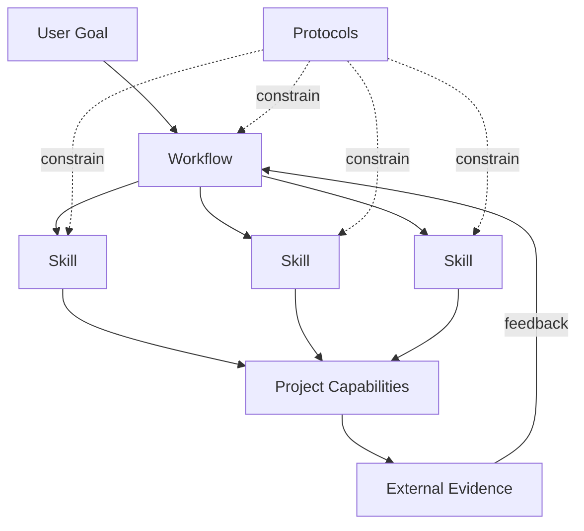

<div align="center">

# PraxFlow

### Engineering workflows for reliable AI agents

**Composable · Evidence-first · Human-guided · Reality-verified**

[English](README.md) · [简体中文](README.zh-CN.md)

[](https://github.com/hamburger-os/PraxFlow/actions/workflows/validate.yml)
[](LICENSE)
[](https://agentskills.io/)
[](docs/roadmap.md)

**Turn capable coding agents into disciplined engineering collaborators.**

</div>

---

## Why PraxFlow?

Modern coding agents can read repositories, edit files, run tools, and generate large amounts of code. The harder problem is not capability—it is **engineering discipline**.

PraxFlow is an opinionated methodology for AI agents, distributed as portable [Agent Skills](https://agentskills.io/). It helps agents decide:

- what to investigate before acting;
- which claims need evidence;
- what the agent should decide itself and what should be escalated to a human;
- how to bound a change before editing;
- how to diagnose failures without locking onto the first plausible explanation;
- what verification is strong enough to support a completion claim;
- what knowledge should survive beyond the current conversation.

PraxFlow is **not** a new agent runtime, a new Skill format, or a generic prompt collection.

> **The goal is not to make an agent do more. The goal is to make the work it does more reliable.**

## Quick start

```bash
git clone https://github.com/hamburger-os/PraxFlow.git
cd PraxFlow

# Install Core workflows + Core skills into a Codex-compatible project
python3 scripts/install.py --target codex --scope project --dest /path/to/project

# Add the embedded reference pack
python3 scripts/install.py \
  --target codex \
  --scope project \
  --dest /path/to/project \
  --pack praxflow-embedded
```

Also supported by the installer:

```bash
# Claude Code
python3 scripts/install.py --target claude --scope project --dest /path/to/project

# TRAE
python3 scripts/install.py --target trae --scope project --dest /path/to/project
```

Current project-level discovery paths:

| Client | Discovery path |
| --- | --- |
| Codex | `.agents/skills/` |
| TRAE | `.agents/skills/` |
| Claude Code | `.claude/skills/` |

See [`adapters/README.md`](adapters/README.md) for adapter details and manual installation.

## The model

PraxFlow separates methodology from execution:



| Concept | Meaning |
| --- | --- |
| **Workflow** | An end-to-end cognitive loop for a class of goals. |
| **Skill** | A reusable cognitive method used by multiple workflows. |
| **Protocol** | Cross-cutting rules for evidence, decisions, change scope, verification, and durable knowledge. |
| **Capability** | A concrete action provided by the current project or environment, such as build, test, deploy, flash, browser, serial, or database access. |

Agent Skills are the **distribution format**. PraxFlow's Workflow/Skill distinction is conceptual; both can be packaged as standards-compatible `SKILL.md` directories.

## v0.1 Core

### Workflows

| Workflow | Cognitive path |
| --- | --- |
| [`develop-feature`](workflows/develop-feature/) | Intent → understand → clarify → design → bounded change → review → verification |
| [`fix-bug`](workflows/fix-bug/) | Symptom → expected behavior → characterize → competing hypotheses → causal fix → regression verification |
| [`understand-project`](workflows/understand-project/) | Goal → orient → survey → targeted trace → evidence-backed working model |
| [`review-change`](workflows/review-change/) | Intent → actual scope → inspect → challenge findings → high-signal review |

### Cognitive skills

| Skill | Core question |
| --- | --- |
| [`survey`](skills/survey/) | Where should I look first? |
| [`trace`](skills/trace/) | How exactly does this behavior happen? |
| [`grill`](skills/grill/) | What genuinely needs to be decided before work can proceed? |
| [`diagnose`](skills/diagnose/) | Which causal explanation best fits the evidence, and how can alternatives be distinguished? |
| [`plan-change`](skills/plan-change/) | What is the smallest causal change boundary that addresses the goal without collateral work? |

`plan-change` is intentionally provisional in v0.1. If real usage shows that it adds little beyond ordinary agent planning, it should be removed rather than preserved for symmetry.

### Core protocols

| Protocol | Purpose |
| --- | --- |
| [`evidence`](protocols/evidence.md) | Separate observations, sources, inferences, assumptions, unknowns, and conflicts. |
| [`decisions`](protocols/decisions.md) | Resolve before asking; escalate consequential decisions through decision gates. |
| [`change-scope`](protocols/change-scope.md) | Prefer the smallest **causal** change, not merely the smallest diff. |
| [`verification`](protocols/verification.md) | Match verification strength and cost to the risk and claim being made. |
| [`knowledge`](protocols/knowledge.md) | Persist stable reusable knowledge, not transient reasoning history. |

## Reference domain: embedded systems

Embedded development is the first PraxFlow reference domain because it is a strong stress test for engineering discipline: hardware facts are externally constrained, concurrency and lifetime errors matter, builds and deployments are real operations, and the physical target provides evidence that model reasoning cannot replace.

[`packs/praxflow-embedded/`](packs/praxflow-embedded/) enriches Core with:

- evidence policy for datasheets, errata, standards, SDK documentation, and reference implementations;
- embedded review concerns such as ISR/thread boundaries, DMA/cache coherency, alignment, ABI, memory lifetime, timing, and error paths;
- a verification ladder that can extend from static checks through build, deploy/flash, target execution, and device-level observation.

It deliberately **does not duplicate Core workflows**.

## Project capabilities

PraxFlow says **when and why** an external action is needed. The project says **how** to perform it.

```text
PraxFlow: "This claim requires runtime verification."
Project:  "Run pytest -q tests/integration/test_reconnect.py"

PraxFlow: "The target behavior must be observed on hardware."
Project:  "Flash with J-Link, then capture CAN + serial output."
```

Project-specific commands such as build, test, deploy, flash, serial, database access, and browser automation belong in project-owned documentation or project-specific Skills—not in PraxFlow Core.

See [`examples/embedded-project/PROJECT_CAPABILITIES.md`](examples/embedded-project/PROJECT_CAPABILITIES.md).

## Design principles

1. **Evidence-first** — model memory is not an authoritative source.
2. **Resolve before ask** — investigate what the agent can resolve before escalating questions to the user.
3. **Human at consequential decisions** — human attention belongs at irreversible, high-impact, policy, compatibility, and engineering tradeoffs.
4. **Goal-directed understanding** — read only as broadly and deeply as the current goal requires.
5. **Minimal causal change** — fix the established cause without unrelated collateral work.
6. **Challenge your own findings** — debugging and review should try to falsify the first plausible explanation.
7. **Proportionate verification** — use the strongest relevant and economical external evidence justified by risk.
8. **Durable knowledge over chat history** — persist only stable, reusable project knowledge.
9. **Extract principles, not prescriptions** — tool-specific practices remain implementation choices unless the underlying problem is universal.

Read the full conceptual model in [`docs/concepts.md`](docs/concepts.md).

## Repository layout

```text
PraxFlow/
├── workflows/      # End-to-end workflow packages
├── skills/         # Reusable cognitive skill packages
├── protocols/      # Cross-cutting methodology
├── packs/          # Domain packs; embedded is the first reference pack
├── adapters/       # Client installation notes
├── examples/       # Project capability examples
├── scripts/        # Installer and validator
├── docs/           # Concepts and roadmap
├── AGENTS.md       # Maintainer / agent instructions
└── CLAUDE.md       # Claude Code entrypoint importing AGENTS.md
```

## Validate

```bash
python3 scripts/validate.py
```

CI also runs the validator and an installer smoke test on every relevant push and pull request.

For normative Agent Skills validation, also use the Agent Skills reference validator (`skills-ref validate`).

## Project status

PraxFlow is **pre-1.0** and intentionally opinionated. v0.1 is a testable baseline, not a frozen standard.

The current priority is to validate the four Core workflows against real engineering tasks and use observed failures to refine—or remove—abstractions. See [`docs/roadmap.md`](docs/roadmap.md).

## Contributing

Contributions are welcome, especially when they include evidence from real usage.

Before proposing a new Core Skill, ask whether it represents a genuinely reusable cognitive method or merely another verb that a capable agent already knows how to perform.

See [`CONTRIBUTING.md`](CONTRIBUTING.md).

## Compatibility references

- [Agent Skills open specification](https://agentskills.io/specification)
- [Claude Code Skills](https://code.claude.com/docs/en/skills)
- [OpenAI Skills / Codex](https://learn.chatgpt.com/docs/build-skills)
- [TRAE changelog](https://www.trae.ai/changelog)

## License

[MIT](LICENSE)
