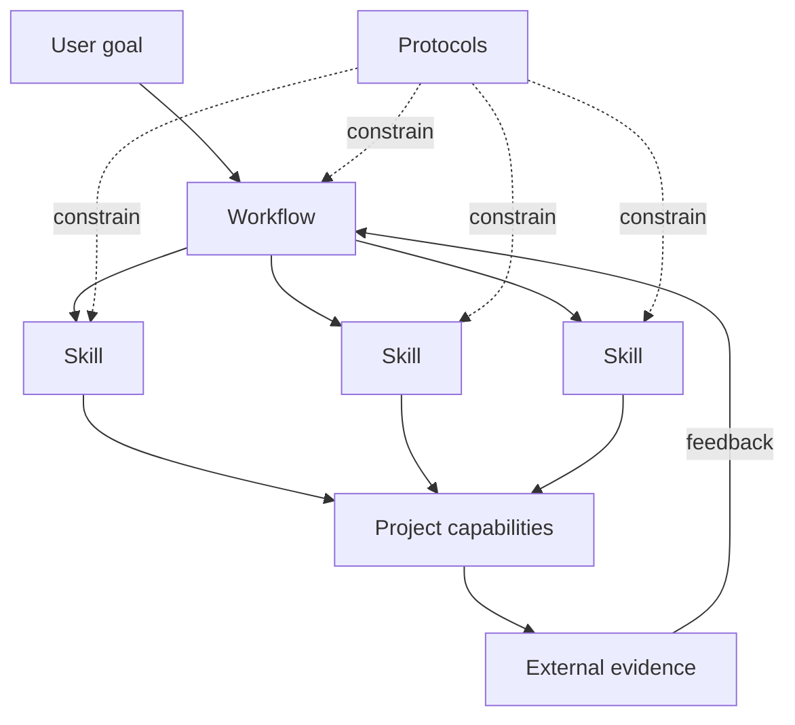
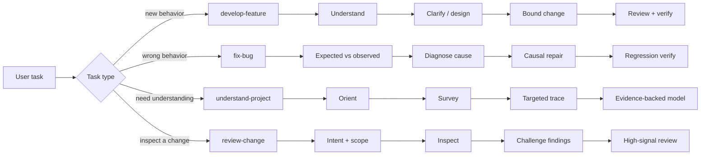
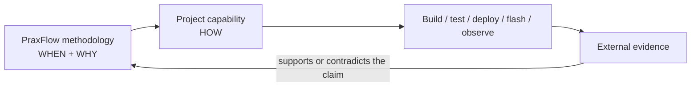

<div align="center">

# PraxFlow

### Engineering workflows for reliable AI agents

**Composable · Evidence-first · Human-guided · Reality-verified**

[English](README.md) · [简体中文](README.zh-CN.md)

[](https://github.com/hamburger-os/PraxFlow/actions/workflows/validate.yml)
[](LICENSE)
[](https://agentskills.io/)
[](docs/roadmap.md)

**Turn capable coding agents into disciplined engineering collaborators.**

<p>
  <a href="#quick-start">Quick start</a> ·
  <a href="docs/concepts.md">Concepts</a> ·
  <a href="evals/README.md">Evals</a> ·
  <a href="case-studies/mcp2518fd-rtthread.md">Case study</a> ·
  <a href="CONTRIBUTING.md">Contributing</a> ·
  <a href="SECURITY.md">Security</a>
</p>

</div>

<p align="center">
  
</p>

---

## Why PraxFlow?

Modern coding agents can read repositories, edit files, run tools, and generate large amounts of code. The harder problem is not capability—it is **engineering discipline**.

PraxFlow is an opinionated methodology for AI agents, distributed as portable [Agent Skills](https://agentskills.io/). It helps agents decide:

- what to investigate before acting;
- which claims need evidence;
- what the agent should decide itself and what should be escalated to a human;
- how to bound a change before editing;
- how to diagnose failures without locking onto the first plausible explanation;
- what verification is strong enough to support a completion claim;
- what knowledge should survive beyond the current conversation.

PraxFlow is **not** a new agent runtime, a new Skill format, or a generic prompt collection.

> **The goal is not to make an agent do more. The goal is to make the work it does more reliable.**

## Quick start

The easiest way to install PraxFlow is through the open Agent Skills ecosystem. No clone or Python setup is required:

```bash
npx skills@latest add hamburger-os/PraxFlow
```

Choose the Workflows, cognitive Skills, and optional Domain Packs you want, then choose the coding agents that should receive them.

Install selected packages non-interactively when you already know what you need:

```bash
npx skills@latest add hamburger-os/PraxFlow \
  --skill develop-feature \
  --skill diagnose \
  --agent codex \
  --yes
```

GitHub CLI can also discover the standard catalog directly:

```bash
gh skill install hamburger-os/PraxFlow
```

All installable PraxFlow packages use the standard flat catalog layout:

```text
skills/<package-name>/SKILL.md
```

PraxFlow's conceptual distinction between Workflow, cognitive Skill, and Domain Pack is recorded in `metadata.praxflow-type`, not encoded in repository path depth. This keeps the source tree directly consumable by standards-compatible installers without a PraxFlow-specific discovery rule.

### Advanced / deterministic installer

The repository still includes a Python installer for deterministic Core installation, explicit Domain Packs, custom output directories, dry runs, and local development. This path requires **Python 3.10 or newer**:

```bash
git clone https://github.com/hamburger-os/PraxFlow.git
cd PraxFlow

# Install Core Workflows + Core Skills into a Codex-compatible project
python3 scripts/install.py --target codex --scope project --dest /path/to/project

# Add the embedded reference pack
python3 scripts/install.py \
  --target codex \
  --scope project \
  --dest /path/to/project \
  --pack praxflow-embedded
```

Current project-level discovery paths used by the built-in installer:

| Client | Discovery path |
| --- | --- |
| Codex | `.agents/skills/` |
| TRAE | `.agents/skills/` |
| Claude Code | `.claude/skills/` |

See [`adapters/README.md`](adapters/README.md) for distribution details, user-level installation, and manual installation.

## The model

PraxFlow separates methodology from environment execution.



| Concept | Meaning |
| --- | --- |
| **Workflow** | An end-to-end cognitive loop for a class of goals. |
| **Skill** | A reusable cognitive method used by multiple workflows. |
| **Protocol** | Cross-cutting rules for evidence, decisions, change scope, verification, and durable knowledge. |
| **Capability** | A concrete action provided by the current project or environment, such as build, test, deploy, flash, browser, serial, or database access. |

Agent Skills are the **distribution format**. PraxFlow's Workflow/Skill distinction is conceptual; both are packaged as standards-compatible `SKILL.md` directories under [`skills/`](skills/).

The top-level [`protocols/`](protocols/) files are canonical methodology references for maintainers, not standalone installable packages. Installable packages carry the operational protocol guidance they need in their own `SKILL.md`; changing a Protocol therefore requires updating the affected packages in the same change.

## v0.1 Core

Four Workflows share reusable Skills and Protocols, but deliberately keep different cognitive structures.



### Workflows

| Workflow | Purpose |
| --- | --- |
| [`develop-feature`](skills/develop-feature/) | Turn intent into a bounded design, implementation, review, and proportionate verification loop. |
| [`fix-bug`](skills/fix-bug/) | Move from symptom to expected behavior, causal diagnosis, bounded repair, and regression verification. |
| [`understand-project`](skills/understand-project/) | Build only the evidence-backed project model needed for the stated understanding goal. |
| [`review-change`](skills/review-change/) | Review a change against intent, actual scope, contracts, evidence, and domain risks with high-signal findings. |

### Cognitive skills

| Skill | Core question |
| --- | --- |
| [`survey`](skills/survey/) | Where should I look first? |
| [`trace`](skills/trace/) | How exactly does this behavior happen? |
| [`grill`](skills/grill/) | What genuinely needs to be decided before work can proceed? |
| [`diagnose`](skills/diagnose/) | Which causal explanation best fits the evidence, and how can alternatives be distinguished? |
| [`plan-change`](skills/plan-change/) | What is the smallest causal change boundary that addresses the goal without collateral work? |

`plan-change` is intentionally provisional in v0.1. If real usage shows that it adds little beyond ordinary agent planning, it should be removed rather than preserved for symmetry.

### Core protocols

| Protocol | Purpose |
| --- | --- |
| [`evidence`](protocols/evidence.md) | Separate observations, sources, inferences, assumptions, unknowns, and conflicts. |
| [`decisions`](protocols/decisions.md) | Resolve before asking; escalate consequential decisions through decision gates. |
| [`change-scope`](protocols/change-scope.md) | Prefer the smallest **causal** change, not merely the smallest diff. |
| [`verification`](protocols/verification.md) | Match verification strength and cost to the risk and claim being made. |
| [`knowledge`](protocols/knowledge.md) | Persist stable reusable knowledge, not transient reasoning history. |

## Reference domain: embedded systems

Embedded development is the first PraxFlow reference domain because it is a strong stress test for engineering discipline: hardware facts are externally constrained, concurrency and lifetime errors matter, builds and deployments are real operations, and the physical target provides evidence that model reasoning cannot replace.

[`praxflow-embedded`](skills/praxflow-embedded/) enriches Core with:

- evidence policy for datasheets, errata, standards, SDK documentation, and reference implementations;
- embedded review concerns such as ISR/thread boundaries, DMA/cache coherency, alignment, ABI, memory lifetime, timing, and error paths;
- a verification ladder that can extend from static checks through build, deploy/flash, target execution, and device-level observation.

It deliberately **does not duplicate Core workflows**.

See the first qualitative reference case: [`MCP2518FD on RT-Thread`](case-studies/mcp2518fd-rtthread.md).

## Project capabilities

PraxFlow says **when and why** external action is needed. The project says **how** its environment performs it.



For example, PraxFlow may conclude that reconnect behavior needs runtime verification; the project capability defines the actual test command. PraxFlow may require target evidence; the embedded project defines the actual flash, serial, and bus-capture procedure.

Project-specific commands belong in project-owned documentation or project-specific Skills—not in PraxFlow Core.

See [`examples/embedded-project/PROJECT_CAPABILITIES.md`](examples/embedded-project/PROJECT_CAPABILITIES.md).

## Evidence over promises

PraxFlow's own development should follow the methodology it recommends.

- [`evals/`](evals/) defines how methodology changes should be compared and recorded.
- [`case-studies/`](case-studies/) contains inspectable engineering cases and explicitly separates qualitative evidence from controlled evals.
- [`CHANGELOG.md`](CHANGELOG.md) records user-visible project changes.
- [`docs/releasing.md`](docs/releasing.md) defines the evidence gate for pre-releases.

The current MCP2518FD case is intentionally labeled **qualitative retrospective**. It is useful evidence for design pressure points, but not a numerical benchmark.

## Design principles

1. **Evidence-first** — model memory is not an authoritative source.
2. **Resolve before ask** — investigate what the agent can resolve before escalating questions to the user.
3. **Human at consequential decisions** — human attention belongs at irreversible, high-impact, policy, compatibility, and engineering tradeoffs.
4. **Goal-directed understanding** — read only as broadly and deeply as the current goal requires.
5. **Minimal causal change** — fix the established cause without unrelated collateral work.
6. **Challenge your own findings** — debugging and review should try to falsify the first plausible explanation.
7. **Proportionate verification** — use the strongest relevant and economical external evidence justified by risk.
8. **Durable knowledge over chat history** — persist only stable, reusable project knowledge.
9. **Extract principles, not prescriptions** — tool-specific practices remain implementation choices unless the underlying problem is universal.

Read the full conceptual model in [`docs/concepts.md`](docs/concepts.md).

## Repository layout

```text
PraxFlow/
├── skills/         # Canonical installable Agent Skills catalog: Workflows, cognitive Skills, Domain Packs
├── protocols/      # Cross-cutting methodology references for maintainers
├── evals/          # Methodology evaluation framework and scenarios
├── case-studies/   # Real engineering cases
├── adapters/       # Client distribution and installation notes
├── examples/       # Project capability examples
├── assets/         # Brand / social assets
├── scripts/        # Deterministic installer and validator
└── docs/           # Concepts, roadmap, release and brand guidance
```

Every installable package is exactly one directory below `skills/`. Conceptual grouping is metadata/catalog information rather than directory semantics.

## Validate

```bash
python3 scripts/validate.py
```

CI runs the PraxFlow structural validator on Python 3.10 and the latest stable Python, checks every `skills/*` package with the pinned Agent Skills reference validator, exercises the built-in installer, and smoke-tests installation through the external Agent Skills CLI.

For local normative Agent Skills validation, you can also use the Agent Skills reference validator (`skills-ref validate`).

## Project status

PraxFlow is **pre-1.0** and intentionally opinionated. v0.1 is a testable baseline, not a frozen standard.

The current priority is to validate the four Core workflows against real engineering tasks and use observed failures to refine—or remove—abstractions. See [`docs/roadmap.md`](docs/roadmap.md).

## Contributing & community

Contributions are welcome, especially when they include evidence from real usage.

- [`CONTRIBUTING.md`](CONTRIBUTING.md) — contribution and abstraction criteria.
- [`CODE_OF_CONDUCT.md`](CODE_OF_CONDUCT.md) — community expectations.
- [`SECURITY.md`](SECURITY.md) — vulnerability reporting policy.
- [`CHANGELOG.md`](CHANGELOG.md) — project history.

Before proposing a new Core Skill, ask whether it represents a genuinely reusable cognitive method or merely another verb that a capable agent already knows how to perform.

## Compatibility references

- [Agent Skills open specification](https://agentskills.io/specification)
- [Agent Skills CLI](https://github.com/vercel-labs/skills)
- [GitHub CLI Agent Skills](https://cli.github.com/manual/gh_skill)
- [Claude Code Skills](https://code.claude.com/docs/en/skills)
- [OpenAI Skills / Codex](https://learn.chatgpt.com/docs/build-skills)
- [TRAE changelog](https://www.trae.ai/changelog)

## License

[MIT](LICENSE)
