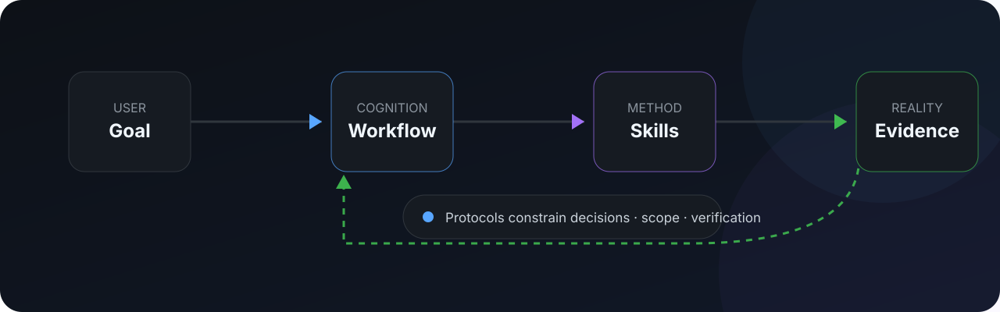
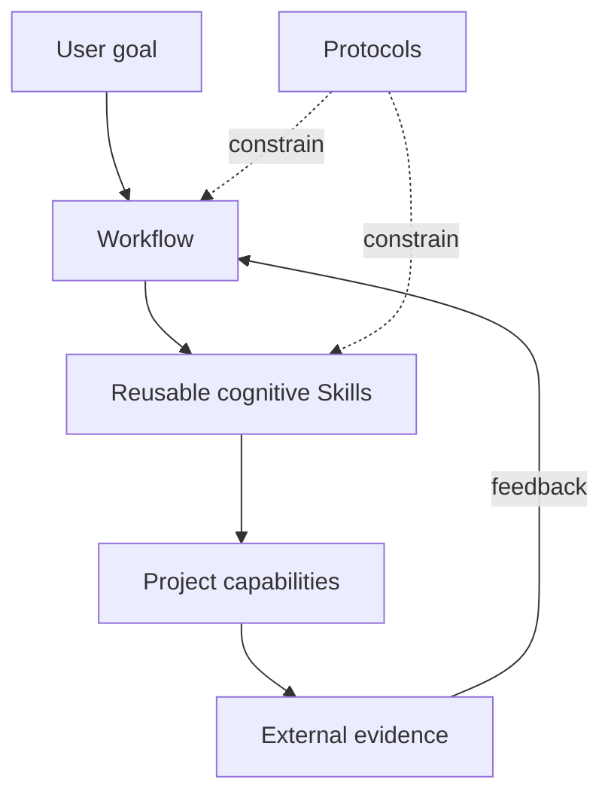

<div align="center">

# PraxFlow

### Engineering workflows for reliable AI agents

**Composable · Evidence-first · Human-guided · Reality-verified**

[English](README.md) · [简体中文](README.zh-CN.md)

[](https://github.com/hamburger-os/PraxFlow/actions/workflows/validate.yml)
[](LICENSE)
[](https://agentskills.io/)
[](docs/roadmap.md)

**Turn capable coding agents into disciplined engineering collaborators.**

<p>
  <a href="#quick-start">Quick start</a> ·
  <a href="docs/getting-started.md">User guide</a> ·
  <a href="docs/concepts.md">Concepts</a> ·
  <a href="case-studies/mcp2518fd-rtthread.md">Case study</a> ·
  <a href="CONTRIBUTING.md">Contributing</a>
</p>

</div>

<p align="center">
  
</p>

---

## Why PraxFlow?

Modern coding agents can read repositories, edit files, run tools, and generate large amounts of code. The harder problem is not raw capability—it is **engineering discipline**.

PraxFlow is an opinionated methodology for AI agents, distributed as portable [Agent Skills](https://agentskills.io/). It helps agents decide:

- what to investigate before acting;
- which claims need evidence;
- what the agent should resolve itself and what needs human judgment;
- how to bound a change before editing;
- how to diagnose failures without locking onto the first plausible explanation;
- what verification is strong enough to support a completion claim;
- what project knowledge is stable enough to preserve.

PraxFlow is **not** a new agent runtime, a new Skill format, or a generic prompt collection.

> **The goal is not to make an agent do more. The goal is to make the work it does more reliable.**

## Quick start

For most users:

```bash
npx skills@latest add hamburger-os/PraxFlow
```

Choose the Workflows, reusable cognitive Skills, optional Domain Packs, and target coding agents you want.

If you already know what you need:

```bash
npx skills@latest add hamburger-os/PraxFlow \
  --skill develop-feature \
  --skill survey \
  --skill trace \
  --skill grill \
  --skill plan-change \
  --agent codex \
  --yes
```

GitHub CLI also provides Agent Skill installation:

```bash
gh skill install hamburger-os/PraxFlow
```

Read **[Getting Started](docs/getting-started.md)** for package selection, installation options, usage examples, expected behavior, and limitations.

## How PraxFlow works

PraxFlow separates methodology from environment execution:



| Concept | Meaning |
| --- | --- |
| **Workflow** | An end-to-end cognitive loop for a class of goals. |
| **Skill** | A reusable cognitive method used by multiple Workflows. |
| **Protocol** | Cross-cutting rules for evidence, decisions, change scope, verification, and durable knowledge. |
| **Capability** | A concrete action supplied by the current project/environment, such as build, test, deploy, flash, browser, serial, or database access. |

The key separation is:

> PraxFlow decides **when and why** an engineering action is needed. The project and agent environment decide **how** to perform it.

Read the full model in **[PraxFlow Concepts](docs/concepts.md)**.

## v0.1 Core

### Workflows

| Workflow | Use it for |
| --- | --- |
| [`develop-feature`](skills/develop-feature/) | New or materially changed behavior: understand → clarify/design → bound → implement → review → verify. |
| [`fix-bug`](skills/fix-bug/) | Incorrect behavior: expected vs observed → diagnose cause → causal repair → regression verification. |
| [`understand-project`](skills/understand-project/) | Building only the evidence-backed project model needed for a stated understanding goal. |
| [`review-change`](skills/review-change/) | High-signal review grounded in intent, actual scope, contracts, evidence, and domain risks. |

### Reusable cognitive Skills

| Skill | Core question |
| --- | --- |
| [`survey`](skills/survey/) | Where should I look first, and how far should I explore? |
| [`trace`](skills/trace/) | How exactly does this behavior happen across calls, data, state, and lifecycle? |
| [`grill`](skills/grill/) | What can the agent resolve itself, and what consequential choice genuinely needs the user? |
| [`diagnose`](skills/diagnose/) | Which causal explanation best fits the evidence, and how can alternatives be distinguished? |
| [`plan-change`](skills/plan-change/) | What is the smallest causal change boundary that addresses the goal? |

`plan-change` is intentionally provisional in v0.1 and may be removed if evaluation shows that it adds little beyond ordinary agent planning.

### Core Protocols

- [`evidence`](protocols/evidence.md) — separate observations, sources, inferences, assumptions, unknowns, and conflicts.
- [`decisions`](protocols/decisions.md) — investigate before asking; escalate consequential decisions.
- [`change-scope`](protocols/change-scope.md) — prefer the smallest **causal** change, not merely the smallest diff.
- [`verification`](protocols/verification.md) — match verification strength and cost to risk and claim strength.
- [`knowledge`](protocols/knowledge.md) — persist stable reusable knowledge, not transient reasoning history.

## Reference domain: embedded systems

[`praxflow-embedded`](skills/praxflow-embedded/) is the first reference Domain Pack. It adds embedded-specific evidence, review, and verification policy without copying the Core Workflows.

It covers concerns such as authoritative hardware references, ISR/thread boundaries, DMA/cache coherency, alignment, ABI, memory lifetime, timing, error paths, and target-level verification.

See the qualitative reference case: **[MCP2518FD on RT-Thread](case-studies/mcp2518fd-rtthread.md)**.

## Agent Skills format and PraxFlow's repository convention

An Agent Skill is a directory containing at minimum:

```text
skill-name/
└── SKILL.md
```

The open specification also defines conventional optional resources such as `scripts/`, `references/`, and `assets/`, while permitting additional files.

PraxFlow chooses this canonical **repository source layout**:

```text
skills/<package-name>/SKILL.md
```

That flat `skills/` catalog is a **PraxFlow distribution convention**. The Agent Skills specification does not require every repository to use a top-level `skills/` directory, and it does not mandate one universal client installation path.

Workflow / Skill / Domain Pack is PraxFlow conceptual metadata (`metadata.praxflow-type`), not path-depth semantics.

PraxFlow also does not add a human README to every Skill package by default. Human concepts, tutorials, and usage guides live under `docs/`; package-local `references/` exist for material agents need to load during execution.

## Documentation

- **[Getting Started](docs/getting-started.md)** / **[入门与使用](docs/getting-started.zh-CN.md)** — principles, package selection, installation, usage, expected behavior.
- **[Concepts](docs/concepts.md)** / **[核心概念](docs/concepts.zh-CN.md)** — the full conceptual model and package-format boundaries.
- **[Roadmap](docs/roadmap.md)** / **[路线图](docs/roadmap.zh-CN.md)** — current scope and evaluation direction.
- **[Client adapters](adapters/README.md)** — installation paths and client compatibility boundaries.
- **[Evals](evals/README.md)** — methodology evaluation framework.
- **[Case studies](case-studies/README.md)** — inspectable engineering evidence.

Maintainer-operational documents such as release procedure, repository settings, and brand guidance are written primarily in Simplified Chinese because the repository currently has one primary maintainer. AI-facing instructions and portable Skill package content remain English-first for agent portability.

## Validate a PraxFlow checkout

```bash
python3 scripts/validate.py
```

CI also runs the pinned Agent Skills reference validator, distribution and installer smoke tests, and Protocol/package synchronization checks.

## Project status

PraxFlow is **pre-1.0**. v0.1 is a testable baseline, not a frozen standard.

The current priority is to evaluate the four Core Workflows on real engineering tasks and use observed failures to refine—or remove—abstractions. See **[Roadmap](docs/roadmap.md)**.

## Contributing & community

Contributions are welcome, especially when they include evidence from real usage.

- [`CONTRIBUTING.md`](CONTRIBUTING.md) — contribution, package, and documentation rules.
- [`CODE_OF_CONDUCT.md`](CODE_OF_CONDUCT.md) — community expectations.
- [`SECURITY.md`](SECURITY.md) — vulnerability reporting.
- [`CHANGELOG.md`](CHANGELOG.md) — project history.

Before proposing a new Core Skill, ask whether it represents a genuinely reusable cognitive method or merely another verb that a capable agent already knows how to perform.

## Compatibility references

- [Agent Skills open specification](https://agentskills.io/specification)
- [Agent Skills CLI](https://github.com/vercel-labs/skills)
- [GitHub CLI Agent Skills](https://cli.github.com/manual/gh_skill)
- [Claude Code Skills](https://code.claude.com/docs/en/skills)
- [OpenAI Skills / Codex](https://learn.chatgpt.com/docs/build-skills)
- [TRAE changelog](https://www.trae.ai/changelog)

## License

[MIT](LICENSE)
