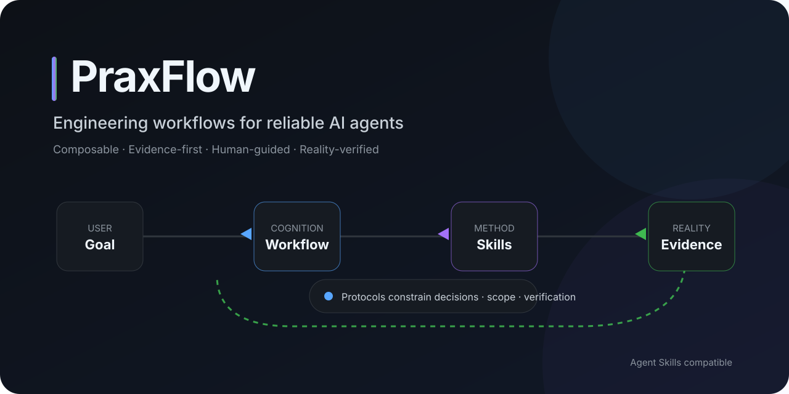
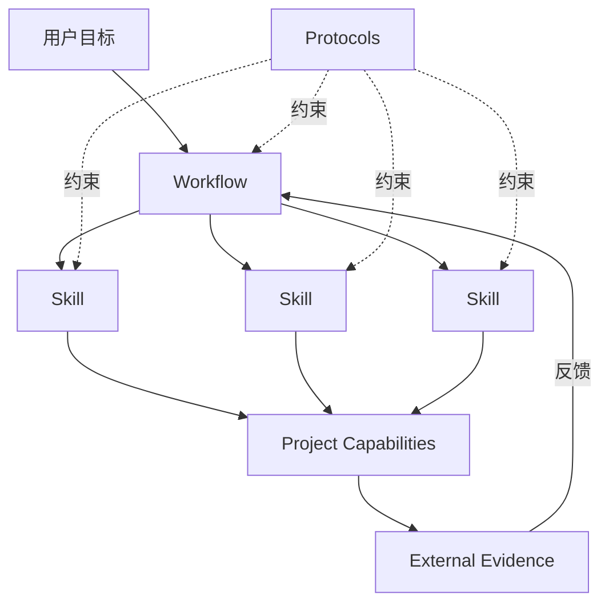
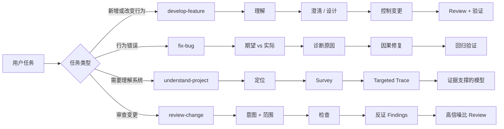
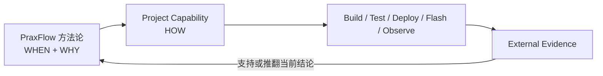

<div align="center">

# PraxFlow

### 面向可靠 AI Agent 的工程工作流

**可组合 · 证据优先 · 人机协同 · 现实验证**

[English](README.md) · [简体中文](README.zh-CN.md)

[](https://github.com/hamburger-os/PraxFlow/actions/workflows/validate.yml)
[](LICENSE)
[](https://agentskills.io/)
[](docs/roadmap.md)

**把“能力很强的 Coding Agent”变成“有工程纪律的协作者”。**

</div>

<p align="center">
  
</p>

<p align="center">
  <a href="#快速开始">快速开始</a> ·
  <a href="docs/concepts.md">核心概念</a> ·
  <a href="evals/README.md">Evals</a> ·
  <a href="case-studies/mcp2518fd-rtthread.md">案例</a> ·
  <a href="CONTRIBUTING.md">贡献</a> ·
  <a href="SECURITY.md">安全</a>
</p>

---

## 为什么需要 PraxFlow？

现代 Coding Agent 已经能够读取仓库、修改文件、运行工具并生成大量代码。真正困难的问题不再只是“它会不会做”，而是：**它能否按照可靠的工程方法做事。**

PraxFlow 是一套面向 AI Agent 的、带明确工程取向的方法论，并通过可移植的 [Agent Skills](https://agentskills.io/) 进行分发。它帮助 Agent 判断：

- 动手之前应该调查什么；
- 哪些结论必须有证据支撑；
- 哪些事情 AI 可以自己决定，哪些必须交给人；
- 修改代码前如何控制影响范围；
- Debug 时如何避免过早锁定第一个“看起来合理”的原因；
- 什么样的验证强度才足以支持“任务已完成”这个结论；
- 哪些知识值得沉淀到长期项目记忆中。

PraxFlow **不是**新的 Agent Runtime、不是新的 Skill 格式，也不是一个通用 Prompt 合集。

> **目标不是让 Agent 做更多，而是让它做出的工程结果更可靠。**

## 快速开始

需要 **Python 3.10 或更高版本**。

```bash
git clone https://github.com/hamburger-os/PraxFlow.git
cd PraxFlow

# 将 Core Workflows + Core Skills 安装到 Codex 项目
python3 scripts/install.py --target codex --scope project --dest /path/to/project

# 加载嵌入式 Reference Pack
python3 scripts/install.py \
  --target codex \
  --scope project \
  --dest /path/to/project \
  --pack praxflow-embedded
```

安装器同时支持：

```bash
# Claude Code
python3 scripts/install.py --target claude --scope project --dest /path/to/project

# TRAE
python3 scripts/install.py --target trae --scope project --dest /path/to/project
```

当前项目级发现目录：

| 客户端 | Discovery Path |
| --- | --- |
| Codex | `.agents/skills/` |
| TRAE | `.agents/skills/` |
| Claude Code | `.claude/skills/` |

具体适配方式和手工安装方法见 [`adapters/README.md`](adapters/README.md)。

## 核心模型

PraxFlow 把“如何工作”和“具体怎么执行”分开：



| 概念 | 含义 |
| --- | --- |
| **Workflow** | 针对一类目标的端到端认知闭环。 |
| **Skill** | 可在多个 Workflow 中复用的独立认知方法。 |
| **Protocol** | 横跨 Workflow / Skill 的行为与信息规则，例如证据、决策、变更范围、验证、长期知识。 |
| **Capability** | 当前项目或环境提供的具体执行能力，例如 build、test、deploy、flash、browser、serial、database。 |

Agent Skills 是 PraxFlow 的**分发格式**。PraxFlow 对 Workflow / Skill 的区分属于方法论概念层；在实际分发时，两者都可以被包装成标准兼容的 `SKILL.md` 目录。

顶层 [`protocols/`](protocols/) 文件是维护者使用的规范性方法论参考，并不是独立安装的 Agent Skill package。可安装的 Workflow / Skill 会在自己的 `SKILL.md` 中携带运行时真正需要的 Protocol 行为，因此修改 Protocol 时必须在同一个变更中同步更新受影响的 packages。

## v0.1 Core

四个 Workflow 可以复用同一批 Skills / Protocols，但刻意保留不同的认知结构。



### Workflows

| Workflow | 作用 |
| --- | --- |
| [`develop-feature`](workflows/develop-feature/) | 从目标走向受控设计、实现、Review 与比例化验证。 |
| [`fix-bug`](workflows/fix-bug/) | 从现象走向期望行为、因果诊断、受控修复和回归验证。 |
| [`understand-project`](workflows/understand-project/) | 只建立当前理解目标真正需要的、有证据支撑的项目模型。 |
| [`review-change`](workflows/review-change/) | 根据意图、实际范围、契约、证据和领域风险输出高信噪比 Review。 |

### Cognitive Skills

| Skill | 核心问题 |
| --- | --- |
| [`survey`](skills/survey/) | 我应该先看哪里？ |
| [`trace`](skills/trace/) | 这个行为到底是怎么发生的？ |
| [`grill`](skills/grill/) | 真正需要在执行前明确的决策是什么？ |
| [`diagnose`](skills/diagnose/) | 哪个因果解释最符合证据？怎样区分多个假设？ |
| [`plan-change`](skills/plan-change/) | 什么是解决目标所需的最小因果变更边界？ |

`plan-change` 在 v0.1 中是刻意保留的 provisional Skill。如果真实使用证明它只是普通 planning 的重复包装，就应该删除，而不是为了目录对称长期保留。

### Core Protocols

| Protocol | 作用 |
| --- | --- |
| [`evidence`](protocols/evidence.md) | 区分观察、来源、推断、假设、未知和冲突。 |
| [`decisions`](protocols/decisions.md) | 先解决再提问；关键决策通过 Decision Gate 上交给人。 |
| [`change-scope`](protocols/change-scope.md) | 追求最小**因果变更**，而不是机械追求最小 diff。 |
| [`verification`](protocols/verification.md) | 根据风险和结论强度匹配合理的验证强度与成本。 |
| [`knowledge`](protocols/knowledge.md) | 沉淀稳定、可复用的项目知识，而不是保存所有临时推理过程。 |

## 第一个 Reference Domain：嵌入式

嵌入式开发非常适合作为 PraxFlow 的第一块压力测试场：硬件事实受外部规范约束，并发、生命周期、时序等问题影响巨大；Build / Deploy 是真实操作；最终目标设备会给出模型推理无法替代的物理世界证据。

[`packs/praxflow-embedded/`](packs/praxflow-embedded/) 在不复制 Core Workflow 的前提下增加：

- 面向 Datasheet、Errata、正式标准、SDK 文档、Reference Implementation 的 Evidence Policy；
- ISR/Thread 边界、DMA/Cache 一致性、Alignment、ABI、Memory Lifetime、Timing、Error Path 等嵌入式 Review 关注点；
- 从静态检查、Build，到 Deploy/Flash、Target Execution、Device Observation 的验证策略。

第一份定性案例见：[`MCP2518FD on RT-Thread`](case-studies/mcp2518fd-rtthread.md)。

## Project Capabilities

PraxFlow 决定：**什么时候、为什么需要某项外部操作。**

具体项目决定：**这项操作到底怎么执行。**



例如 PraxFlow 可以判断“重连行为需要运行时验证”；具体项目再定义真正的测试命令。PraxFlow 可以要求真实 Target Evidence；嵌入式项目再定义烧录、串口、总线抓取等具体方法。

因此 build、test、deploy、flash、serial、database、browser automation 等具体命令应该属于项目自己的文档或项目级 Skills，而不是 PraxFlow Core。

参考 [`examples/embedded-project/PROJECT_CAPABILITIES.md`](examples/embedded-project/PROJECT_CAPABILITIES.md)。

## 用证据证明 PraxFlow，而不是只宣传 PraxFlow

PraxFlow 自己也应该遵守它要求 Agent 遵守的方法：

- [`evals/`](evals/) 定义方法论变化如何进行对照和记录；
- [`case-studies/`](case-studies/) 保存真实工程案例，并明确区分定性证据和受控 Eval；
- [`CHANGELOG.md`](CHANGELOG.md) 记录面向用户的变化；
- [`docs/releasing.md`](docs/releasing.md) 定义 pre-release 的证据门槛。

当前 MCP2518FD 案例明确标记为 **qualitative retrospective**。它能说明设计压力点，但不能冒充数值 Benchmark。

## 设计原则

1. **Evidence-first** —— 模型记忆不是权威事实源。
2. **Resolve before ask** —— 代码、文档和工具能够回答的问题，不应该先问用户。
3. **Human at consequential decisions** —— 人的注意力应该集中在不可逆、高影响、策略、兼容性和真正的工程取舍上。
4. **Goal-directed understanding** —— 只读到当前目标真正需要的广度和深度，不默认 Archify 整个仓库。
5. **Minimal causal change** —— 修正已经建立的原因，不进行无关扩张。
6. **Challenge your own findings** —— Debug 和 Review 都应该主动尝试推翻第一个合理解释。
7. **Proportionate verification** —— 根据风险选择最强且合理经济的外部证据。
8. **Durable knowledge over chat history** —— 长期知识应该脱离临时对话上下文。
9. **Extract principles, not prescriptions** —— 工具特定做法只是实现选择，除非它背后的问题确实具有普适性。

完整概念模型见 [`docs/concepts.md`](docs/concepts.md)。

## 仓库结构

```text
PraxFlow/
├── workflows/      # 端到端 Workflow packages
├── skills/         # 可复用 Cognitive Skills
├── protocols/      # 横切工程方法
├── packs/          # Domain Packs；embedded 为第一参考实现
├── evals/          # 方法论 Eval 规范与场景
├── case-studies/   # 真实工程案例
├── adapters/       # 客户端安装适配说明
├── examples/       # Project Capability 示例
├── assets/         # Brand / Social assets
├── scripts/        # Installer / Validator
└── docs/           # Concepts / Roadmap / Release / Brand
```

## 校验

```bash
python3 scripts/validate.py
```

CI 会在 Python 3.10 和最新稳定版 Python 上运行 PraxFlow structural validator，使用固定版本的 Agent Skills reference validator 检查全部 package，并覆盖受支持 target 的安装路径与主要失败模式。

本地如需按 Agent Skills 规范进行验证，也可以使用 reference validator：`skills-ref validate`。

## 项目状态

PraxFlow 当前处于 **pre-1.0** 阶段，并且刻意保持 opinionated。

v0.1 是一个可以被真实工程任务验证的基线，而不是已经冻结的新标准。当前最重要的工作，是把四个 Core Workflow 放到真实 Feature、Bug、陌生工程理解和 Code Review 中进行压力测试，并根据真实失败去修改甚至删除抽象。

详见 [`docs/roadmap.md`](docs/roadmap.md)。

## 贡献与社区

欢迎贡献，尤其欢迎带有真实使用证据的改进。

- [`CONTRIBUTING.md`](CONTRIBUTING.md) —— 贡献方式与抽象准入标准；
- [`CODE_OF_CONDUCT.md`](CODE_OF_CONDUCT.md) —— 社区行为规范；
- [`SECURITY.md`](SECURITY.md) —— 安全漏洞报告方式；
- [`CHANGELOG.md`](CHANGELOG.md) —— 项目变化记录。

在提出新的 Core Skill 之前，请先问：它是否真的是可以跨 Workflow 复用的独立认知方法，还是只是一个强 Agent 原本就会执行的普通动词？

## 兼容性参考

- [Agent Skills 开放规范](https://agentskills.io/specification)
- [Claude Code Skills](https://code.claude.com/docs/en/skills)
- [OpenAI Skills / Codex](https://learn.chatgpt.com/docs/build-skills)
- [TRAE Changelog](https://www.trae.ai/changelog)

## License

[MIT](LICENSE)
