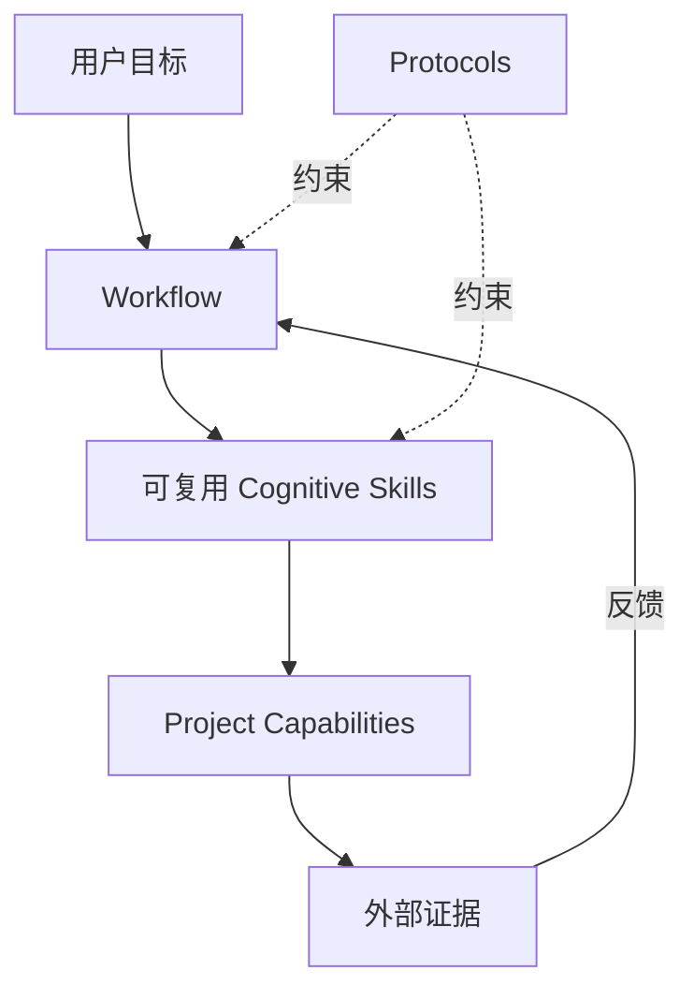

<div align="center">

# PraxFlow

### 面向可靠 AI Agent 的工程工作流

**可组合 · 证据优先 · 人机协同 · 现实验证**

[English](README.md) · [简体中文](README.zh-CN.md)

[](https://github.com/hamburger-os/PraxFlow/actions/workflows/validate.yml)
[](LICENSE)
[](https://agentskills.io/)
[](docs/roadmap.zh-CN.md)

**把“能力很强的 Coding Agent”变成“有工程纪律的协作者”。**

<p>
  <a href="#快速开始">快速开始</a> ·
  <a href="docs/getting-started.zh-CN.md">使用指南</a> ·
  <a href="docs/concepts.zh-CN.md">核心概念</a> ·
  <a href="case-studies/mcp2518fd-rtthread.md">案例</a> ·
  <a href="CONTRIBUTING.md">贡献</a>
</p>

</div>

<p align="center">
  
</p>

---

## 为什么需要 PraxFlow？

现代 Coding Agent 已经能够读取仓库、修改文件、运行工具并生成大量代码。真正困难的问题不再只是“它会不会做”，而是：**它能否按照可靠的工程方法做事。**

PraxFlow 是一套面向 AI Agent 的、有明确工程取向的方法论，并通过可移植的 [Agent Skills](https://agentskills.io/) 进行分发。它帮助 Agent 判断：

- 动手之前应该调查什么；
- 哪些结论必须有证据支撑；
- 哪些事情 AI 应该自己解决，哪些真正需要人的判断；
- 修改代码前如何限定影响范围；
- Debug 时如何避免过早锁定第一个“看起来合理”的原因；
- 什么验证强度才足以支持“任务已完成”这个结论；
- 哪些项目知识稳定到值得长期保存。

PraxFlow **不是**新的 Agent Runtime、不是新的 Skill 格式，也不是一个通用 Prompt 合集。

> **目标不是让 Agent 做更多，而是让它做出的工程结果更可靠。**

## 快速开始

大多数用户直接使用 Agent Skills 生态 Installer：

```bash
npx skills@latest add hamburger-os/PraxFlow
```

在交互界面里选择需要的 Workflow、可复用 Cognitive Skills、可选 Domain Pack，以及目标 Coding Agent。

如果已经明确知道要安装什么：

```bash
npx skills@latest add hamburger-os/PraxFlow \
  --skill develop-feature \
  --skill survey \
  --skill trace \
  --skill grill \
  --skill plan-change \
  --agent codex \
  --yes
```

GitHub CLI 也提供 Agent Skill 安装能力：

```bash
gh skill install hamburger-os/PraxFlow
```

完整的 package 选择、安装方式、实际使用示例、预期 Agent 行为和限制，见 **[PraxFlow 入门与使用指南](docs/getting-started.zh-CN.md)**。

## PraxFlow 怎么工作

PraxFlow 把方法论和环境执行分开：



| 概念 | 含义 |
| --- | --- |
| **Workflow** | 针对一类目标的端到端认知闭环。 |
| **Skill** | 可以在多个 Workflow 中复用的独立认知方法。 |
| **Protocol** | 横跨 Workflow / Skill 的证据、决策、变更范围、验证和长期知识规则。 |
| **Capability** | 当前项目或环境提供的具体执行能力，例如 build、test、deploy、flash、browser、serial、database。 |

最重要的分层是：

> PraxFlow 决定一项工程动作 **什么时候做、为什么做**；具体项目和 Agent 环境决定 **怎么做**。

完整模型见 **[PraxFlow 核心概念](docs/concepts.zh-CN.md)**。

## v0.1 Core

### Workflows

| Workflow | 适用目标 |
| --- | --- |
| [`develop-feature`](skills/develop-feature/) | 新增或明显改变行为：理解 → 澄清/设计 → 控制范围 → 实现 → Review → 验证。 |
| [`fix-bug`](skills/fix-bug/) | 错误行为：期望 vs 实际 → 诊断原因 → 因果修复 → 回归验证。 |
| [`understand-project`](skills/understand-project/) | 只建立当前理解目标真正需要的、有证据支撑的项目模型。 |
| [`review-change`](skills/review-change/) | 根据意图、真实范围、契约、证据和领域风险输出高信噪比 Review。 |

### 可复用 Cognitive Skills

| Skill | 核心问题 |
| --- | --- |
| [`survey`](skills/survey/) | 我应该先看哪里，调查应该扩展到多远？ |
| [`trace`](skills/trace/) | 这个行为跨调用、数据、状态和生命周期到底是怎么发生的？ |
| [`grill`](skills/grill/) | 哪些问题 Agent 能自己解决，哪些重要选择真的需要用户判断？ |
| [`diagnose`](skills/diagnose/) | 哪个因果解释最符合证据，怎样区分其他可能性？ |
| [`plan-change`](skills/plan-change/) | 解决目标所需的最小因果变更边界是什么？ |

`plan-change` 在 v0.1 中刻意保持 provisional；如果 Eval 证明它没有比普通 Agent planning 带来足够增益，就应该删除。

### Core Protocols

- [`evidence`](protocols/evidence.md) —— 区分 observation、source、inference、assumption、unknown 和 conflict。
- [`decisions`](protocols/decisions.md) —— 先调查再提问；把真正重要的决策升级给人。
- [`change-scope`](protocols/change-scope.md) —— 追求最小**因果变更**，而不是机械追求最小 diff。
- [`verification`](protocols/verification.md) —— 让验证强度和成本与风险及最终 Claim 相匹配。
- [`knowledge`](protocols/knowledge.md) —— 沉淀稳定可复用知识，而不是保存临时推理历史。

## 第一个 Reference Domain：Embedded Systems

[`praxflow-embedded`](skills/praxflow-embedded/) 是第一个 Reference Domain Pack。它在不复制 Core Workflow 的前提下，增加嵌入式领域特定的 Evidence、Review 和 Verification 策略。

它覆盖 Datasheet / Errata 等权威资料、ISR/Thread 边界、DMA/Cache 一致性、Alignment、ABI、Memory Lifetime、Timing、Error Path 和 Target-level Verification 等关注点。

第一份定性参考案例见 **[MCP2518FD on RT-Thread](case-studies/mcp2518fd-rtthread.md)**。

## Agent Skills 标准与 PraxFlow 仓库约定

一个最小 Agent Skill 是：

```text
skill-name/
└── SKILL.md
```

开放规范还约定了 `scripts/`、`references/`、`assets/` 等常见可选资源目录，同时允许其他额外文件。

PraxFlow 自己选择下面这个 canonical **repository source layout**：

```text
skills/<package-name>/SKILL.md
```

这里需要明确区分：扁平 `skills/` catalog 是 **PraxFlow 的分发约定**。Agent Skills Specification 并没有要求所有仓库都必须使用一个名为 `skills/` 的顶层目录，也没有规定所有客户端必须使用同一个安装路径。

Workflow / Skill / Domain Pack 的区别记录在 `metadata.praxflow-type`，不是 path depth 的语义。

PraxFlow 也不会默认给每一个 Skill package 添加人类 README。给人的原理、教程、示例和使用说明统一放在 `docs/`；package 内的 `references/` 用于 Agent 执行时按需加载。

## 文档

- **[入门与使用](docs/getting-started.zh-CN.md)** / **[Getting Started](docs/getting-started.md)** —— 原理、package 选择、安装、使用和预期行为。
- **[核心概念](docs/concepts.zh-CN.md)** / **[Concepts](docs/concepts.md)** —— 完整概念模型以及 package format 边界。
- **[路线图](docs/roadmap.zh-CN.md)** / **[Roadmap](docs/roadmap.md)** —— 当前范围和 Eval 方向。
- **[Client Adapters](adapters/README.md)** —— 安装路径和客户端兼容性边界。
- **[Evals](evals/README.md)** —— 方法论评估框架。
- **[Case Studies](case-studies/README.md)** —— 可检查的工程案例证据。

仓库维护操作类文档（例如 Release Procedure、Repository Settings、Brand Guidance）主要使用简体中文，因为当前绝大部分维护工作由主要维护者完成。AI-facing 指令和可移植 Skill package 内容则保持英文优先，保证 Agent 可移植性。

## 验证 PraxFlow Checkout

```bash
python3 scripts/validate.py
```

CI 还会运行固定版本的 Agent Skills reference validator、Distribution / Installer smoke tests，以及 Protocol/package synchronization checks。

## 项目状态

PraxFlow 当前是 **pre-1.0**。v0.1 是一个可测试的 baseline，而不是冻结标准。

当前优先级是让四个 Core Workflows 在真实工程任务中接受检验，再根据观察到的失败来修改——或者删除——现有抽象。见 **[路线图](docs/roadmap.zh-CN.md)**。

## 贡献与社区

欢迎贡献，尤其欢迎带有真实使用证据的改进。

- [`CONTRIBUTING.md`](CONTRIBUTING.md) —— 贡献、package 和文档规则。
- [`CODE_OF_CONDUCT.md`](CODE_OF_CONDUCT.md) —— 社区规范。
- [`SECURITY.md`](SECURITY.md) —— 漏洞报告。
- [`CHANGELOG.md`](CHANGELOG.md) —— 项目历史。

在提出一个新的 Core Skill 前，先确认它代表的是**真正可复用的认知方法**，而不是又给一个有能力的 Agent 本来就会执行的普通动作起了名字。

## Compatibility References

- [Agent Skills open specification](https://agentskills.io/specification)
- [Agent Skills CLI](https://github.com/vercel-labs/skills)
- [GitHub CLI Agent Skills](https://cli.github.com/manual/gh_skill)
- [Claude Code Skills](https://code.claude.com/docs/en/skills)
- [OpenAI Skills / Codex](https://learn.chatgpt.com/docs/build-skills)
- [TRAE changelog](https://www.trae.ai/changelog)

## License

[MIT](LICENSE)
