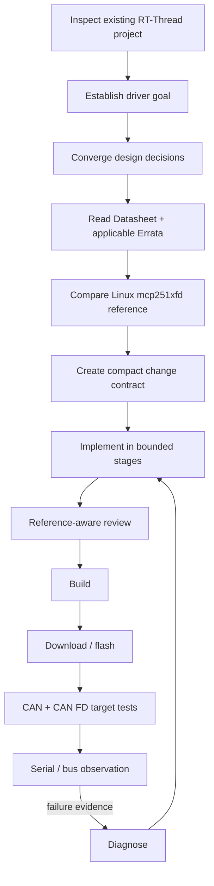

# Case Study: MCP2518FD on RT-Thread

> **Status:** qualitative retrospective, not a controlled PraxFlow eval.

This reference case reconstructs the engineering workflow used when reasoning about adding an MCP2518FD CAN/CAN FD driver to an existing RT-Thread project. The original exercise combined project inspection, hardware references, an established Linux driver, staged implementation, review, build/download, and real-device observation.

Raw agent transcripts, controlled baseline runs, and complete device artifacts are not currently preserved in this repository. Therefore this document describes the workflow and methodology pressure points; it does **not** claim measured improvement percentages or statistical results.

## Context

MCP2518FD is a useful reference problem for PraxFlow because correctness depends on information the model should not guess:

- device registers and initialization behavior;
- chip errata;
- CAN/CAN FD protocol details;
- interrupt and FIFO behavior;
- RT-Thread device-framework conventions;
- SPI access and project-specific driver style;
- ISR/thread boundaries and memory/resource policy;
- physical target behavior.

The task therefore stresses the separation between general methodology, domain policy, project capabilities, and external evidence.

## Engineering goal

Add MCP2518FD CAN/CAN FD support to an existing RT-Thread project while fitting the project's existing CAN device framework and engineering constraints.

A compact working contract for such a task can include:

- use the project's existing SPI device path;
- integrate with the existing RT-Thread CAN device framework;
- use GPIO interrupt handling for the controller IRQ;
- avoid long SPI operations directly in ISR context;
- follow project memory/error/logging conventions;
- make consequential register behavior traceable to applicable datasheet/errata evidence;
- verify Classic CAN and CAN FD behavior on the target.

These details are an example working contract, not a universal MCP2518FD implementation prescription.

## Evidence roles

The case illustrates why PraxFlow separates evidence by role instead of simply collecting more context.

| Evidence | Primary role |
| --- | --- |
| MCP2518FD Datasheet / Reference Manual | Hardware behavior and register-level facts |
| Applicable Errata | Corrections and constraints that may override affected datasheet descriptions |
| Linux `mcp251xfd` driver | Mature implementation reference and edge-case handling patterns |
| Existing RT-Thread drivers/project code | Local software architecture, conventions, APIs, and integration style |
| Feature/change contract | What this project intends to implement now |
| Build/download/device observations | External evidence that the implementation works in its real environment |

A reference implementation is evidence about *how another system solved the problem*; it is not authority over hardware facts or the local project's architecture.

## Workflow

The diagram is intentionally methodological. Concrete build, download, bus-capture, and serial commands belong to the project as capabilities.

## Important PraxFlow pressure points

### 1. Understand the local project before designing the driver

The agent needs enough project context to answer questions such as:

- how SPI devices are accessed;
- how CAN devices are registered;
- where ISR and worker/thread boundaries are drawn;
- how errors and logging are represented;
- how memory and resources are managed;
- how the project builds and deploys.

This should be goal-directed exploration, not a full repository rewrite into architecture documentation.

### 2. Resolve facts from authoritative sources

Register values, device modes, errata conditions, timing behavior, and hardware constraints should be sourced rather than recalled from model memory.

When applicable errata conflicts with an affected datasheet description, the conflict must be surfaced and applicability checked before implementation proceeds.

### 3. Use the Linux driver as reference, not as specification

The mature Linux `mcp251xfd` driver can reveal implementation patterns, failure handling, sequencing, and edge cases. Those patterns still need to be translated into RT-Thread's local abstractions instead of copying Linux OS structure wholesale.

### 4. Keep human decisions focused

Questions answerable from code, datasheet, errata, or reference implementations should be investigated by the agent first.

Human attention is better spent on consequential choices such as:

- intended feature scope;
- public/project integration boundaries;
- ISR versus worker-thread strategy;
- memory/resource policy;
- acceptance criteria.

### 5. Verify on the real target

Compilation is necessary evidence but not sufficient for hardware behavior.

A reasonable verification ladder for this case can progress through:

The exact ladder should remain proportional to the change and available test environment.

## What this case supports

This case is strong qualitative support for several PraxFlow design choices:

- embedded behavior needs a Domain Pack rather than a separate copy of every Core Workflow;
- project-specific build/deploy/debug commands should remain project capabilities;
- evidence authority and applicability matter more than raw context volume;
- `survey`, `trace`, `grill`, `diagnose`, and bounded change planning can be composed inside a larger feature workflow;
- “implementation generated” and “engineering task complete” are different states.

## What this case does not prove

Without preserved controlled runs, it does not establish:

- a numerical reduction in defects;
- a measured productivity improvement;
- superiority over another agent framework;
- that every Core Skill independently improves results;
- that the current v0.1 wording is optimal.

Those questions belong in repeatable evals.

## Next step

Re-run a bounded version of this task using [`../evals/scenario-template.md`](../evals/scenario-template.md), preserving:

- exact task statement;
- project fixture/commit;
- available references;
- baseline and PraxFlow conditions;
- agent questions;
- files read/changed;
- review findings;
- build and device evidence;
- failure iterations.

That run can turn this retrospective into an inspectable evaluation case.
