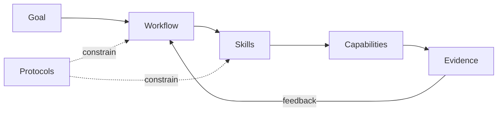

# PraxFlow Brand Guide

本文主要给 PraxFlow 维护者使用，因此默认使用简体中文；公开使用的英文 Tagline、Description 和品牌短语保持英文原文。

PraxFlow 的视觉和文字应该让人感觉它是一套工程方法论，而不是一个泛化 AI 产品。

## Positioning

**Name:** PraxFlow  
**Tagline:** Engineering workflows for reliable AI agents.  
**Short promise:** Turn capable coding agents into disciplined engineering collaborators.

## Voice

优先使用：

- 具体的工程语言；
- Evidence，而不是 Hype；
- 能够被验证的简洁 Claim；
- 明确的 Tradeoff 和 Limitation；
- 稳定、克制、自信的语气。

避免：

- “ultimate”、“revolutionary”、“10x” 等夸张表达；
- 暗示 PraxFlow 是 Runtime 或 Autonomous-agent Platform；
- 把拟人化 Robot Image 当作主要品牌身份；
- 让 Core Brand 依赖某一个 Vendor。

## Visual Direction

Canonical banner 是 [`../assets/praxflow-banner.svg`](../assets/praxflow-banner.svg)。

视觉原则：

- Dark neutral background；
- 克制使用 blue / violet / green accent；
- Systems diagram 和 feedback loop motif；
- 强 Typography 和足够 whitespace；
- 保持一个清楚的视觉层级，不用装饰性密度制造“高级感”。

核心视觉隐喻是一个闭合工程反馈环：



## Repository Social Preview

使用 canonical banner 导出的 2:1 social image。推荐尺寸：**1280 × 640**。

Preview 只保留：

- PraxFlow；
- Tagline；
- 四词 positioning line；
- Workflow / Evidence 的视觉 motif。

不要加入 Vendor Logo，也不要加入长 feature list。

## Project Description

建议 GitHub Description：

> Composable, evidence-first engineering workflows for reliable AI agents — packaged as portable Agent Skills.

## Recommended GitHub Topics

```text
agent-skills
ai-agents
coding-agents
llm-agents
agentic-workflows
ai-engineering
software-engineering
developer-tools
human-in-the-loop
codex
claude-code
trae
embedded-systems
```

Topics 应保持描述性。不要为了 discoverability 添加会弱化项目真实定位的泛化关键词。

## Documentation Voice

面向用户的文档不仅要列 Feature 或安装命令，还应该解释：

- 为什么这个机制存在；
- 它试图避免什么典型失败；
- 什么时候应该使用；
- 用户应该怎样使用；
- 可以期待什么行为变化；
- 哪些边界仍然 experimental 或由 Client 决定。

AI-facing `SKILL.md` 则应优先保证指令精确、可执行和上下文效率，不需要复制营销或教程式内容。
