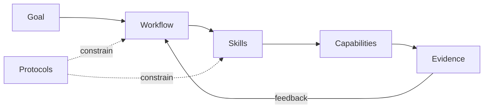

# PraxFlow Brand Guide

PraxFlow should look like an engineering methodology, not a generic AI product.

## Positioning

**Name:** PraxFlow  
**Tagline:** Engineering workflows for reliable AI agents.  
**Short promise:** Turn capable coding agents into disciplined engineering collaborators.

## Voice

Prefer:

- concrete engineering language;
- evidence over hype;
- concise claims that can be tested;
- explicit tradeoffs and limitations;
- calm confidence.

Avoid:

- “ultimate”, “revolutionary”, “10x”, or similar hype;
- implying that PraxFlow is a runtime or autonomous-agent platform;
- anthropomorphic robot imagery as the primary identity;
- vendor dependence in the core brand.

## Visual direction

The canonical banner is [`../assets/praxflow-banner.svg`](../assets/praxflow-banner.svg).

Visual principles:

- dark neutral background;
- restrained blue / violet / green accents;
- systems-diagram and feedback-loop motifs;
- strong typography and whitespace;
- one clear visual hierarchy rather than decorative density.

The visual metaphor is a closed engineering loop:



## Repository social preview

Use a 2:1 social image derived from the canonical banner. Recommended dimensions: **1280 × 640**.

The preview should contain only:

- PraxFlow;
- the tagline;
- the four-word positioning line;
- the workflow/evidence visual motif.

Do not include vendor logos or long feature lists.

## Project description

Recommended GitHub Description:

> Composable, evidence-first engineering workflows for reliable AI agents — packaged as portable Agent Skills.

## Recommended GitHub Topics

```text
agent-skills
ai-agents
coding-agents
llm-agents
agentic-workflows
ai-engineering
software-engineering
developer-tools
human-in-the-loop
codex
claude-code
trae
embedded-systems
```

Topics should stay descriptive. Do not add broad discovery bait that weakens the project's actual positioning.
