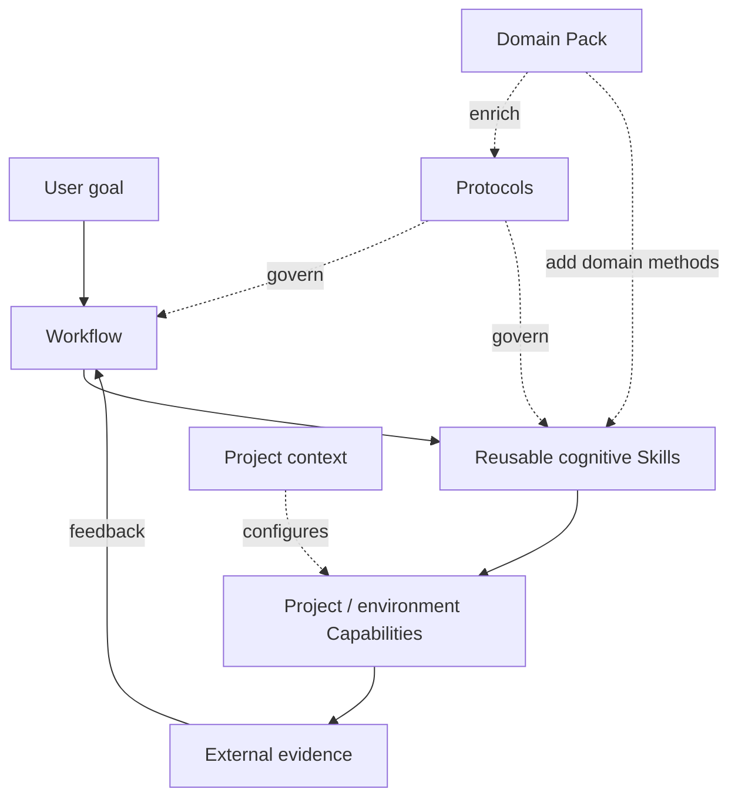
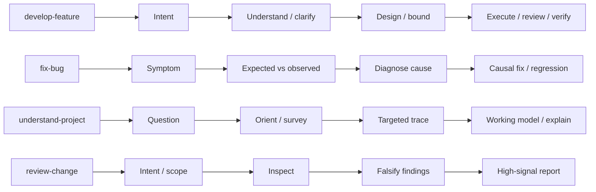
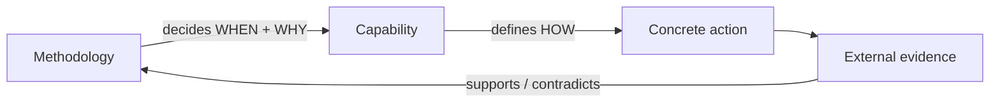
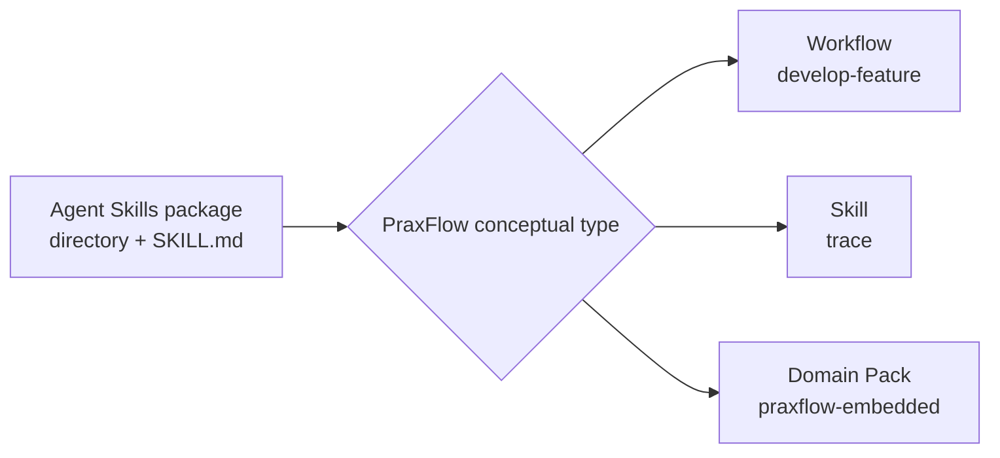
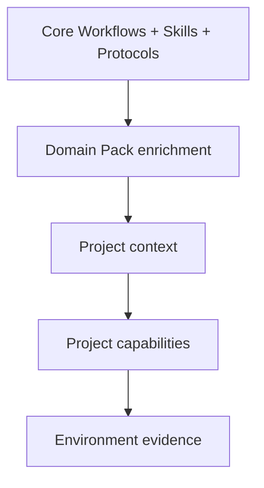
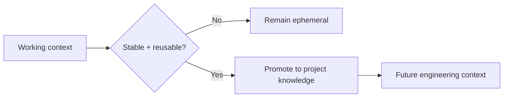

# PraxFlow Concepts

PraxFlow separates methodology from packaging and environment execution. This document is the conceptual reference for v0.1.

## Conceptual model



The four first-class concepts are **Workflow**, **Skill**, **Protocol**, and **Capability**. A Domain Pack enriches Core behavior; it does not introduce a fifth execution model.

## Workflow

A Workflow is an end-to-end cognitive loop for a class of goals. It defines meaningful phases, branching, human checkpoints, failure paths, and completion criteria.

A Workflow is not merely a list of Skills. Different task types can reuse the same Skills while requiring different cognitive structures.



## Skill

A Skill is a reusable cognitive method used in more than one Workflow.

A Core Skill should be worth activating independently because it improves *how* the agent reasons, not because it names an ordinary action the agent can already perform.

Examples:

- `survey`: establish where to look and how far to explore.
- `trace`: reconstruct a behavior across calls, events, data, state, async boundaries, and lifecycles.
- `grill`: converge an under-specified problem by investigating before asking and escalating only consequential choices.
- `diagnose`: compare causal hypotheses and design high-information experiments.
- `plan-change`: bound the causal impact of a change before high-cost editing begins.

## Protocol

A Protocol is a cross-cutting rule set that applies across Workflows and Skills.

Protocols are not intended to be invoked as standalone commands. They define how claims, decisions, changes, verification, and durable knowledge should be handled.

Core protocols:

- **Evidence** — how claims are grounded and conflicts are surfaced.
- **Decisions** — what the agent may resolve autonomously and what requires human judgment.
- **Change Scope** — how to minimize collateral change without confusing minimal diff with correct causal repair.
- **Verification** — how completion claims are supported by proportionate external evidence.
- **Knowledge** — what should be persisted beyond ephemeral model context.

The repository-level `protocols/*.md` files are the canonical methodology references for maintainers. They are intentionally not standalone Agent Skill packages and are not copied by the installer. Portable packages under `skills/` embed the operational subset they require, so a Protocol change is incomplete until the affected packages are updated in the same change.

## Capability

A Capability is a concrete action available in the current environment.

Examples:

- `build`
- `test`
- `lint`
- `deploy`
- `flash`
- `read-serial`
- `ssh-target`
- `open-browser`
- `query-database`

Capabilities are project- or environment-specific. PraxFlow Core should not hard-code the command that implements them.



## Agent Skill package vs conceptual Skill

The Agent Skills open format uses a directory with `SKILL.md` as a portable distribution unit. PraxFlow uses that format for multiple conceptual types.



So `develop-feature/SKILL.md` is technically an Agent Skill package but conceptually a PraxFlow **Workflow**. `trace/SKILL.md` is both an Agent Skill package and a PraxFlow **Skill**.

PraxFlow records the conceptual type in `metadata.praxflow-type`.

### Canonical package layout

Conceptual taxonomy and physical distribution are deliberately separate. Every installable unit uses the same lowest-common-denominator repository convention:

```text
skills/
├── develop-feature/
│   └── SKILL.md
├── diagnose/
│   └── SKILL.md
└── praxflow-embedded/
    ├── SKILL.md
    └── references/
```

There is no canonical `workflows/` or `packs/` package root. A standards-compatible installer should be able to discover the entire public catalog by scanning `skills/*/SKILL.md` without PraxFlow-specific recursion or path rules.

This choice has three consequences:

1. **Portability wins over visual taxonomy.** Repository path depth must not become part of PraxFlow semantics.
2. **Metadata carries conceptual type.** `metadata.praxflow-type` distinguishes `workflow`, `skill`, and `pack`.
3. **Catalog presentation is optional.** Files such as `skills.sh.json` may group packages for humans or installer UIs, but runtime identity remains the package directory plus `SKILL.md`.

## Domain Pack

A Domain Pack enriches Core behavior without copying Core Workflows.

A pack may add:

- evidence authority and conflict policy;
- domain-specific review concerns;
- verification strategy;
- genuinely domain-specific cognitive Skills.

A pack must not contain project-specific commands, credentials, architecture facts, or deployment targets.



## Working artifacts

Different Workflows create different artifacts. PraxFlow does not force every task through a universal `write-spec` Skill.

Examples:

- `develop-feature` may create a compact change spec.
- `fix-bug` creates a failure model and causal fix plan.
- `understand-project` creates a provisional working model.
- `review-change` creates a review contract and findings.

Artifacts exist to support reasoning, alignment, or handoff. They are not automatically durable documentation.

## Ephemeral context vs project knowledge

Temporary reasoning belongs in the active working context. Stable, reusable facts and decisions may be promoted into project-owned documentation.



Do not persist:

- exploratory dead ends;
- temporary hypotheses;
- a transcript of every interaction;
- transient tool output.

Consider persisting:

- stable architecture facts;
- durable constraints;
- consequential decisions;
- important invariants;
- recurring project capabilities;
- failure modes that materially affect future engineering.

## v0.1 non-goals

PraxFlow v0.1 does not define:

- a Workflow DSL;
- a custom runtime;
- a marketplace;
- a universal model-selection policy;
- a replacement for MCP/tools;
- a universal project documentation format;
- a generic `implement` Skill;
- a generic `verify` Skill.

These can be reconsidered only when real usage produces evidence that the current structure is insufficient.
