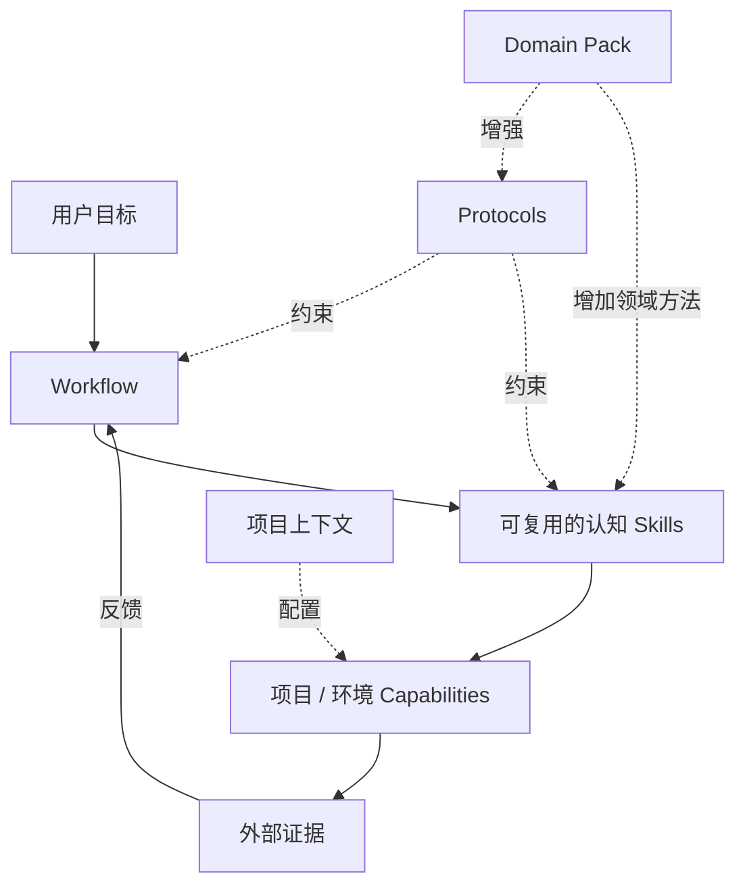
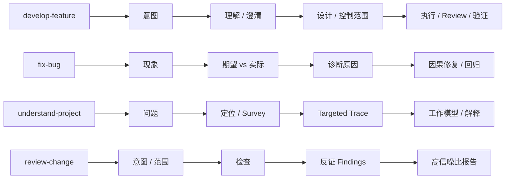
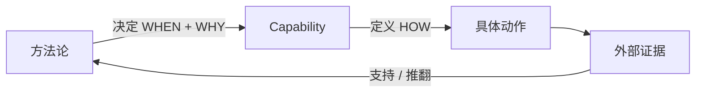
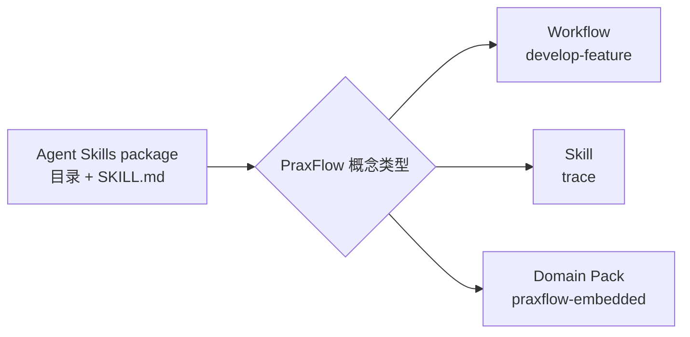
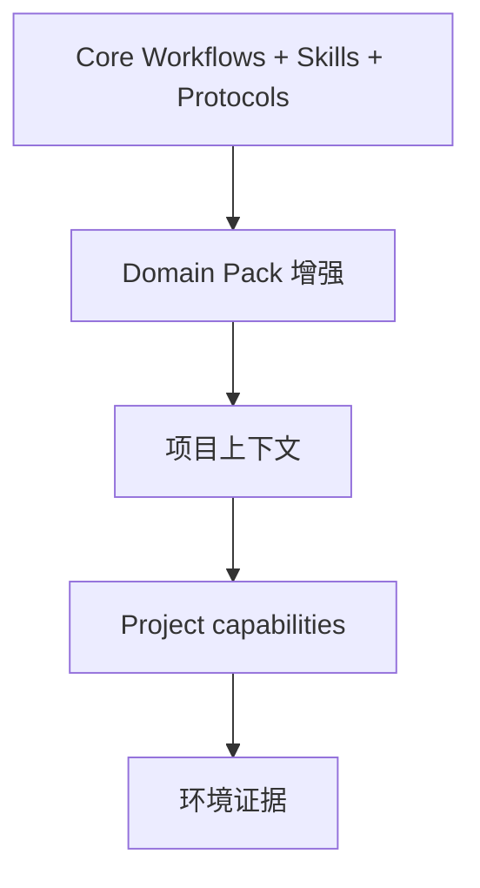
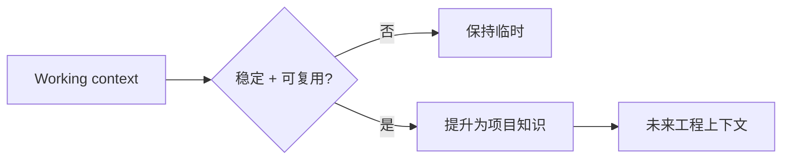

# PraxFlow 核心概念

[English](concepts.md) · [简体中文](concepts.zh-CN.md)

PraxFlow 把方法论、分发格式和环境执行明确分开。本文是 v0.1 的概念参考。

## 概念模型



PraxFlow 有四个一等概念：**Workflow、Skill、Protocol、Capability**。Domain Pack 用来增强 Core 行为，并不引入第五种执行模型。

## Workflow

Workflow 是针对一类目标的端到端认知闭环。它定义有意义的阶段、分支、人工检查点、失败路径以及完成条件。

Workflow 不只是 Skills 的列表。不同任务类型可以复用同一批 Skills，但仍然需要不同的认知结构。



## Skill

Skill 是可以在多个 Workflow 中复用的独立认知方法。

Core Skill 应该值得被单独激活，是因为它改善了 Agent **如何思考和判断**，而不是因为它只是给一个 Agent 本来就会做的普通动作起了名字。

例如：

- `survey`：确定先看哪里，以及调查应该扩展到多远。
- `trace`：跨调用、事件、数据、状态、异步边界和生命周期还原行为链路。
- `grill`：先调查可调查事实，只把真正重要的选择升级给人，从而收敛不完整需求。
- `diagnose`：比较多个因果假设，并设计高信息量实验进行区分。
- `plan-change`：在高成本修改开始前，限定变更的因果影响范围。

## Protocol

Protocol 是跨 Workflow 和 Skill 生效的横向规则集合。

Protocol 不是用来作为独立命令调用的。它规定如何处理事实声明、决策、变更、验证以及长期知识。

Core Protocols：

- **Evidence** —— 如何让结论有依据，并显式暴露冲突。
- **Decisions** —— 哪些问题 Agent 可以自主解决，哪些需要人的判断。
- **Change Scope** —— 如何减少无关改动，同时不把“最小 diff”误当成“正确的因果修复”。
- **Verification** —— 如何用与风险相匹配的外部证据支撑“已完成”这类结论。
- **Knowledge** —— 哪些内容值得超出当前上下文长期保存。

仓库级 `protocols/*.md` 是维护方法论时的规范性参考。它们刻意不是独立可安装的 Agent Skill package，也不会被 Installer 单独复制。`skills/` 下的可移植 package 会携带自己运行时所需的 Protocol 子集，所以修改 Protocol 时，必须在同一个变更中同步更新受影响的 package。

## Capability

Capability 是当前项目或环境中实际可执行的具体动作。

例如：

- `build`
- `test`
- `lint`
- `deploy`
- `flash`
- `read-serial`
- `ssh-target`
- `open-browser`
- `query-database`

Capability 与具体项目或环境绑定。PraxFlow Core 不应该硬编码实现这些动作的具体命令。



## Agent Skill package 与 PraxFlow Skill 的区别

Agent Skills 开放格式使用“一个目录 + `SKILL.md`”作为可移植分发单元。PraxFlow 使用这个格式来承载多种自己的概念类型。



因此，`develop-feature/SKILL.md` 在 Agent Skills 格式层面是一个 Agent Skill package，但在 PraxFlow 概念层面它是 **Workflow**。`trace/SKILL.md` 则既是 Agent Skill package，也是 PraxFlow **Skill**。

PraxFlow 使用 `metadata.praxflow-type` 记录概念类型。

### Agent Skills 规范真正规定了什么

Agent Skills 规范定义的是 **单个 Skill 目录内部的格式**。最小 Skill 目录只需要：

```text
skill-name/
└── SKILL.md
```

常见的可选资源目录包括：

```text
scripts/
references/
assets/
```

规范也允许其他额外文件。

需要特别注意：**Agent Skills 规范并没有要求所有仓库必须把 Skill 放在一个名为 `skills/` 的顶层目录中，也没有规定所有客户端必须使用同一个安装路径。**

### PraxFlow 的 canonical repository layout

PraxFlow 自己选择一个扁平的 canonical source catalog：

```text
skills/
├── develop-feature/
│   └── SKILL.md
├── diagnose/
│   └── SKILL.md
└── praxflow-embedded/
    ├── SKILL.md
    └── references/
```

PraxFlow 不维护独立的 `workflows/` 或 `packs/` package root。这是 **PraxFlow 自己的仓库约定**，目的在于让常见的 repository installer 可以直接发现公共 catalog，而不需要理解 PraxFlow 专用的递归目录规则。

这个选择带来三个结果：

1. **可移植性优先于视觉分类。** 仓库路径深度不能成为 PraxFlow 语义的一部分。
2. **Metadata 承载概念类型。** 使用 `metadata.praxflow-type` 区分 `workflow`、`skill` 和 `pack`。
3. **Catalog 展示是可选层。** `skills.sh.json` 可以为人或 Installer UI 做分组展示，但 package 的运行时身份仍然来自 package 目录及其 `SKILL.md`。

### 人类文档与 package resources 的边界

PraxFlow **不会默认给每一个 `skills/<name>/` package 添加 `README.md`**。

Agent Skills 规范允许 README 作为额外文件存在，但它对 Skill discovery 或 activation 没有特殊作用。给人看的原理说明、教程、示例和使用指南统一放在 `docs/`；package 内的 `references/` 则用于保存 Agent 在执行过程中可能按需读取的内容。

这样可以保留 Agent Skills 的 progressive disclosure：

1. Catalog 阶段只加载 `name` + `description`；
2. Skill 被激活后加载 `SKILL.md`；
3. 只有真正需要时才加载 `references/`、`scripts/`、`assets/` 等资源。

## Domain Pack

Domain Pack 在不复制 Core Workflow 的前提下增强 Core 行为。

一个 Pack 可以增加：

- Evidence 的权威性和冲突处理策略；
- 领域特定的 Review 关注点；
- 验证策略；
- 真正属于某个领域的认知 Skills。

Pack 不应该包含：

- 项目专用命令；
- credentials；
- 某一个项目的架构事实；
- 部署目标等项目环境细节。



## Working artifacts

不同 Workflow 会产生不同的临时工作产物。PraxFlow 不会强迫所有任务都经过一个通用的 `write-spec` Skill。

例如：

- `develop-feature` 可能形成一个紧凑的 change spec；
- `fix-bug` 会形成 failure model 和 causal fix plan；
- `understand-project` 会形成 provisional working model；
- `review-change` 会形成 review contract 和 findings。

这些 artifact 的存在是为了帮助推理、对齐或交接，不代表它们天然应该成为长期文档。

## 临时上下文与项目长期知识

临时推理属于当前 working context。只有稳定、可复用的事实和决策，才值得提升为项目拥有的长期文档。



通常不要长期保存：

- 探索过程中被排除的路径；
- 临时假设；
- 每一次交互的完整 transcript；
- 瞬时工具输出。

可以考虑长期保存：

- 稳定的架构事实；
- 长期约束；
- 重要决策；
- 关键 invariants；
- 反复使用的 Project Capabilities；
- 会持续影响未来工程工作的 failure modes。

## v0.1 非目标

PraxFlow v0.1 不定义：

- Workflow DSL；
- 自定义 Runtime；
- Marketplace；
- 通用 model-selection policy；
- MCP / tools 的替代方案；
- 通用项目文档格式；
- 通用 `implement` Skill；
- 通用 `verify` Skill。

只有真实使用提供证据，证明当前结构不足时，才应该重新考虑这些方向。

安装和实际使用方式见 [`getting-started.zh-CN.md`](getting-started.zh-CN.md)。
