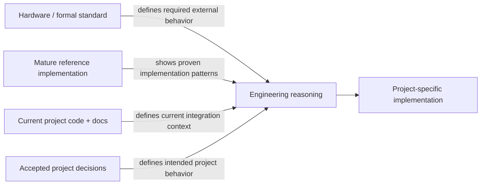
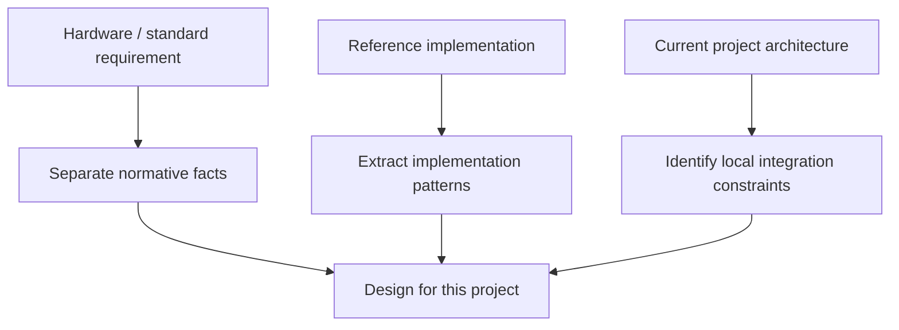

# Embedded Evidence Policy

Embedded engineering frequently depends on facts that cannot be safely reconstructed from model memory or code style alone. This policy augments the Core Evidence Protocol.

## First question: what kind of fact is this?

Do not force every source into one global ranking. Authority depends on the claim.

### Project intent / accepted behavior

For what the project **intends** to do, prefer evidence such as:

1. accepted task/feature decisions;
2. current architecture/component decisions and maintained project docs;
3. tests/contracts that intentionally encode behavior;
4. current code as evidence of actual implementation.

If accepted design and current code disagree, treat that as a discrepancy to investigate. Do not assume code automatically wins merely because it executes.

### Actual current implementation

For what the software **currently does**, inspect current code and executed behavior. Docs may describe intended or older behavior and should not override direct observation without explanation.

### External hardware/protocol/OS facts

For claims defined outside the project, use the most applicable authoritative source for the exact device, revision, version, profile, or SDK.

Typical authority relationships:

- applicable silicon **Errata** modifies or qualifies Datasheet/Reference Manual behavior for affected revisions;
- **Datasheet / Reference Manual** defines device registers, electrical/functional behavior, sequencing, and constraints within its scope;
- a formal **protocol/industry standard** defines wire/protocol requirements within the selected profile/version;
- official **OS/SDK/API documentation** defines supported software behavior for the relevant version;
- official vendor examples provide implementation guidance but do not override specifications;
- mature reference implementations show how real systems handle sequencing, edge cases, and integration, but they are not normative specifications;
- model memory is a discovery aid, not final authority.

Do not compare sources that answer different questions as though they form one simple total order.

## Source roles

Keep the role of each evidence class explicit rather than blending them together:

A reference implementation can inform the design without becoming the specification. Project intent can select among valid designs without redefining hardware or protocol facts.

## Applicability before authority

Before relying on a source, verify when practical:

- exact chip/part family;
- silicon revision;
- document revision/date;
- protocol version/profile;
- SDK/OS/library version;
- board-specific electrical constraints;
- feature mode/configuration relevant to the behavior.

A newer but inapplicable source can be worse evidence than an older applicable one.

## Conflict handling

When sources disagree:

1. quote/summarize the exact conflicting claims narrowly;
2. check revision, scope, mode, and applicability;
3. determine whether an Errata explicitly supersedes base documentation;
4. inspect mature implementations only as supporting evidence;
5. if the conflict changes implementation and cannot be resolved, stop and surface it through the Decisions Protocol.

Never silently choose whichever source makes the current code easier to justify.

## Reference implementations

Use mature implementations to learn:

- initialization sequencing;
- state machines;
- error recovery;
- concurrency boundaries;
- edge-case handling;
- integration patterns.

Do not copy platform-specific abstractions blindly into another RTOS/OS/project.

## Local reference handling

PraxFlow does not mandate a particular ingestion/search stack.

Prefer reference systems that preserve:

- original authoritative source;
- human-readable access where practical;
- version/revision information;
- traceable location (section/page/symbol);
- targeted retrieval instead of loading thousands of pages into context;
- ability for an engineer to return to the source and verify the claim.

PDF-to-Markdown conversion, text search, structured extraction, local indexing, or MCP/document services are implementation choices. Choose them based on document type, confidentiality, quality, and project constraints.

## OCR caution

For register-heavy or numeric hardware documents, OCR errors can silently change identifiers, addresses, bit values, or timing numbers. Prefer a reliable text layer when available and verify consequential numeric/register claims against the original source.
