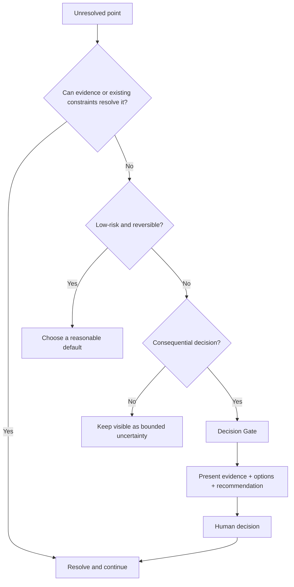

# Decisions Protocol

The Decisions Protocol defines when an agent should continue autonomously and when it should ask a human to decide.

## Core rule: Resolve before ask

Before asking a question, determine whether the answer can be obtained by:

1. inspecting the current project/environment;
2. reading relevant documentation or evidence;
3. applying an existing constraint or prior decision;
4. choosing a low-risk, reversible default.

Do not make the user act as a search engine for information the agent can investigate.

## Decision Gate

Escalate to a human when a consequential choice cannot be resolved from evidence and existing constraints.

A good Decision Gate contains:

- the decision that is actually required;
- the relevant facts and constraints already established;
- a small set of meaningful options;
- the agent's recommendation;
- the tradeoff and impact of each plausible option.

Do not ask an open-ended question when the engineering space has already been narrowed enough to make a recommendation.

## Practical levels

These levels guide behavior; they are not a required output schema.

### D1 — Preference / reversible choice

Examples:

- naming;
- minor output shape;
- local organization;
- low-cost implementation detail with no external contract impact.

Default behavior: choose a reasonable option and continue. Mention the choice only when useful.

### D2 — Engineering tradeoff

Examples:

- compatibility versus simplification;
- latency versus memory;
- consistency versus availability;
- implementation complexity versus extensibility;
- resource use versus responsiveness.

Default behavior: provide a recommendation and obtain confirmation when the tradeoff materially changes system behavior or long-term constraints.

### D3 — Boundary / high-impact choice

Examples:

- public API or data-format changes;
- irreversible migrations or deletion;
- security/permission boundaries;
- production deployment with material risk;
- hardware operations that can damage equipment or require physical intervention;
- consequential policy or compliance choices.

Default behavior: block execution until the required human decision is explicit.

## Avoid approval theater

Human-in-the-loop does not mean asking for confirmation after every phase.

Do not repeatedly ask:

- “Should I continue?”
- “May I inspect this file?” when access already exists;
- “Is this code path correct?” when it can be traced;
- “Which file contains X?” when the repository can be searched.

Concentrate human attention on consequential decisions and genuinely unavailable information.

## Decisions as durable information

A consequential decision should be captured in the active artifact when it affects future work.

Examples:

- preserve the public API;
- offline data must not be lost;
- an additional 2 MB memory budget is acceptable;
- choose backward-compatible migration over a clean break.

Do not persist every conversational preference as project knowledge. Use the Knowledge Protocol to decide what survives the task.

## Stop condition

The agent should stop asking once enough information exists to make a safe, bounded next move.

The goal is not to remove all uncertainty. The goal is to resolve the uncertainty that materially changes the decision or risk profile.
