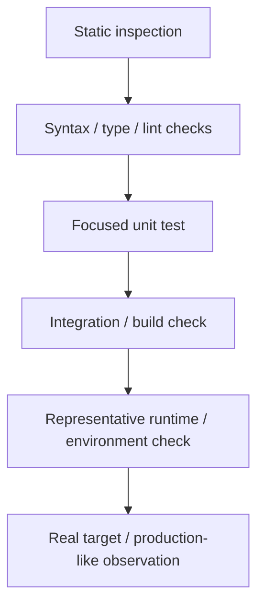

# Verification Protocol

The Verification Protocol governs when an agent may claim that work is complete or a conclusion is established.

## Core rule

Generated output is not completion. Completion claims should be supported by proportionate external verification relevant to the actual goal and risk.

## Choose verification by four factors

1. **Relevance** — does the check exercise the behavior that changed?
2. **Strength** — how directly does it test the claim?
3. **Cost** — time, compute, environment access, human effort, and disruption.
4. **Risk** — consequence of an incorrect completion claim.

Do not mechanically run every available check. Do not stop at a weak check when a materially stronger, affordable check is available and relevant.

## Verification ladder

The exact ladder is domain-specific, but evidence often becomes stronger as it moves from reasoning to executed behavior:

This is not an absolute ranking. A focused property test may be stronger for a claim than a broad production smoke test. Choose the check that actually bears on the claim.

## Feature completion

A feature is not done merely because code was written or a build passed.

Check, as appropriate:

- the stated goal is satisfied;
- accepted constraints and decisions are preserved;
- implementation matches the intended design;
- relevant review has completed;
- the strongest reasonable verification has passed;
- unresolved consequential conflicts are surfaced;
- stable project knowledge is updated when necessary.

## Bug-fix verification

Prefer three layers when feasible:

1. **Original failure** — the previously failing reproduction or captured condition no longer fails.
2. **Causal verification** — evidence supports that the diagnosed mechanism changed as intended, not merely that the symptom disappeared once.
3. **Regression coverage** — nearby supported behavior remains intact.

## Review-finding verification

Before escalating an important review finding:

- inspect surrounding context;
- search for invariants or guards that may invalidate the finding;
- trace the path when necessary;
- run a targeted check when it provides high information value.

A review finding that survives an honest attempt to falsify it is more valuable than a larger list of speculative concerns.

## Unavailable verification

If the strongest desired verification cannot be performed because a capability or environment is unavailable:

1. perform the strongest available alternative;
2. state what was and was not verified;
3. do not phrase an untested claim as confirmed;
4. identify the missing capability only when it matters to the user's decision.

## Domain packs

Domain Packs may define:

- preferred verification ladders;
- required checks for high-risk operations;
- domain-specific failure conditions;
- what constitutes real-world evidence.

Project capabilities provide the concrete commands or tools used to execute those checks.
