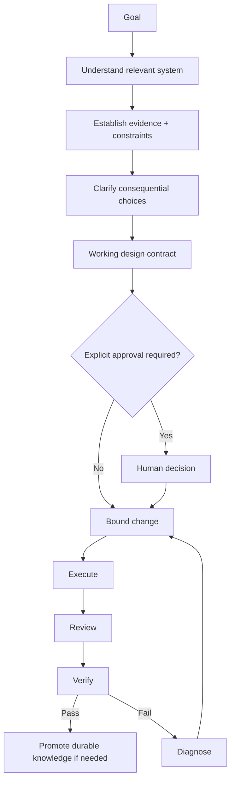
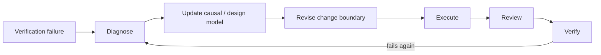

# Develop Feature

Move from a feature goal to a bounded, reviewed, evidence-backed implementation. Do not begin broad editing while key behavior or consequential tradeoffs are still unresolved.



## Workflow

### 1. Establish the goal

Identify:

- desired behavior;
- relevant acceptance signal;
- obvious scope/constraints already provided.

The user does not need to provide a complete specification. Converging the design is part of this Workflow.

### 2. Understand only what the goal requires

Use `survey` when available to map relevant project areas.

Use `trace` when the feature depends on an existing call/data/state/lifecycle path.

Investigate project facts before asking the user. Treat the project model as provisional and deepen it only when a high-value unknown affects design.

### 3. Establish important evidence and constraints

Identify facts the design depends on:

- current behavior and contracts;
- existing tests/docs/decisions;
- external APIs/specifications when relevant;
- applicable Domain Pack evidence policy;
- assumptions that remain unverified.

Do not let model memory silently substitute for consequential external facts.

If authoritative evidence conflicts, attempt to resolve version/scope/applicability. Otherwise surface the conflict before implementation.

### 4. Clarify consequential choices

If the goal/design is materially under-specified, use `grill` when available.

Resolve investigable questions yourself. Escalate only decisions that materially change behavior, compatibility, architecture, risk, resource use, policy, or verification.

Recommend an option before asking whenever the evidence supports a recommendation.

### 5. Create the working design contract

For a non-trivial feature, maintain a compact artifact with the relevant subset of:

```markdown
# Feature

## Goal

## Design

## Constraints

## Decisions

## Verification
```

Do not turn this into a transcript. Record stable facts, accepted decisions, and the intended mechanism.

Small, reversible changes may use a lighter inline contract rather than a file.

### 6. Decide whether explicit approval is required

Do not require approval theater for every feature.

Obtain explicit human approval before execution when the design includes consequential choices such as:

- breaking public contracts;
- data migration/destruction;
- security/permission changes;
- major architecture boundaries;
- production or physical risk;
- other high-impact irreversible decisions.

For ordinary bounded engineering choices, continue when constraints and design are sufficiently established.

### 7. Bound the change

Use `plan-change` when available and the change is non-trivial.

The plan should identify:

- causal change surface;
- affected contracts/state/data/lifecycle;
- explicit non-goals when useful;
- verification path.

Avoid generic todo lists.

### 8. Execute the accepted plan

Use the agent's native editing/tool capabilities. There is no separate PraxFlow `implement` Skill.

During execution:

- prefer minimal causal change;
- avoid unrelated cleanup/refactoring;
- follow applicable Domain Pack rules;
- keep assumptions visible;
- stop and reassess if scope expands materially.

### 9. Review the change

Inspect the actual change against:

- feature goal;
- design/decisions;
- constraints/contracts;
- actual scope;
- applicable domain concerns;
- failure behavior and boundary cases.

For substantial changes, use the `review-change` Workflow when available or apply its method inline.

Important findings should survive an attempt to falsify them before they are escalated.

### 10. Verify proportionately

Select the strongest relevant and economical checks available through project capabilities.

Possible checks include:

- focused tests;
- type/lint/static checks;
- build;
- integration tests;
- representative runtime checks;
- deployment/target/device checks when the behavior depends on the real environment.

Do not claim unperformed checks as passed.

### 11. Failure loop

If verification fails:



Do not blindly keep editing until tests happen to pass.

Use `diagnose` when available for non-obvious failures.

### 12. Promote durable knowledge selectively

Update project-owned documentation only when the work established stable reusable information such as:

- architecture behavior;
- durable constraints/invariants;
- consequential decisions;
- recurring project capabilities;
- important domain/reference applicability.

Do not persist transient reasoning history.

## Completion criteria

The feature is complete only when, proportionate to its risk:

- the goal is satisfied;
- implementation matches the accepted design;
- consequential conflicts are resolved or explicitly surfaced;
- change scope is justified;
- relevant review is complete;
- the strongest reasonable verification has passed;
- remaining unverified claims are clearly identified;
- durable project knowledge is updated when necessary.
