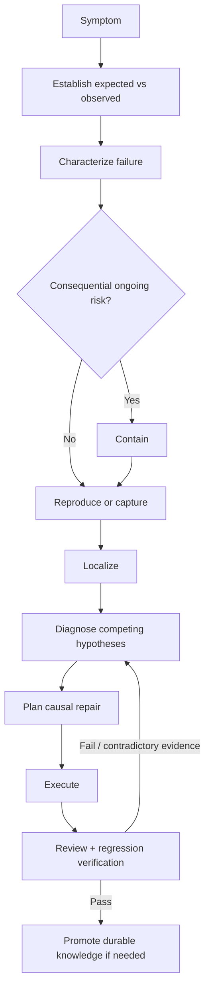
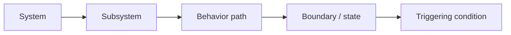
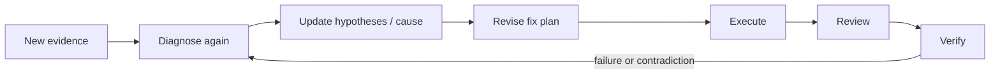

# Fix Bug

Treat the reported symptom or proposed cause as a starting point, not as established root cause.

## Workflow

### 1. Establish expected versus observed behavior

Determine what should happen and what actually happens.

Expected behavior may come from:

- an accepted requirement/spec;
- tests;
- API/protocol contracts;
- applicable standards/domain references;
- previously verified behavior;
- an explicit user decision.

If the expected behavior is itself disputed, resolve that before editing code.

### 2. Characterize the failure

Build a useful failure signature:

- when it occurs and when it does not;
- deterministic/intermittent;
- input, state, timing, concurrency, environment, or version dependence;
- first known bad change/version when available;
- observable impact;
- logs/traces/core dumps/metrics/device output associated with it.

Do not rush from vague symptom to patch.

### 3. Contain consequential risk when necessary

If continued operation can cause data loss, security exposure, physical damage, corruption, or expanding production impact, contain the problem before deep diagnosis when feasible.

Containment is not the causal fix. Preserve useful evidence when possible.

### 4. Reproduce or capture

Prefer a controlled reproduction when feasible.

If reliable reproduction is impractical, obtain the strongest observable failure record available. Do not block indefinitely on “must reproduce locally.”

Record uncertainty when only a user report or partial capture is available.

### 5. Localize the responsible path

Use `survey` to find the relevant area when the location is unclear.

Use `trace` when the failure depends on a call/event/data/state/lifecycle path.

Narrow progressively:

### 6. Diagnose causally

Use `diagnose` when available.

Maintain competing hypotheses when the cause is not established. Prefer discriminating experiments that can rule explanations in or out.

Do not keep modifying code around a hypothesis that evidence contradicts.

A sufficiently established cause should explain the important symptoms and be consistent with available evidence. When feasible, intervention on the proposed mechanism should change the failure behavior.

### 7. Plan the causal repair

Use `plan-change` when the fix is non-trivial.

Target the smallest **causal** change, not the smallest textual diff.

The fix plan should identify:

- established cause;
- mechanism being changed;
- expected change surface;
- preserved contracts;
- tempting unrelated changes that remain out of scope;
- original failure verification;
- nearby regression verification.

If the repair requires a consequential new tradeoff, use a Decision Gate before executing it.

### 8. Execute

Modify the system using native agent capabilities.

If implementation evidence shows that the causal model is wrong, stop and return to diagnosis instead of broadening the patch until the symptom disappears.

### 9. Review the fix

Ask:

- does this change address the established cause?
- does it merely hide or suppress the symptom?
- did scope expand beyond the causal repair?
- are existing contracts preserved?
- did the fix create new failure paths, retries, races, leaks, or swallowed errors?
- what domain-specific risks apply?

Use `review-change` when a formal review is warranted.

### 10. Regression verification

Prefer three layers when feasible:

1. **Original failure:** the previously failing reproduction/captured condition now behaves correctly.
2. **Causal verification:** evidence supports that the diagnosed mechanism changed as intended.
3. **Regression surface:** nearby valid behavior remains correct.

Choose checks proportionately to risk and available capabilities.

### 11. Failure loop

If the fix fails verification or new evidence contradicts the cause:

Do not preserve a favored diagnosis merely because code has already been written for it.

### 12. Promote durable knowledge selectively

Persist only reusable lessons such as:

- a previously unknown invariant;
- an important lifecycle/concurrency constraint;
- a durable failure mode;
- a consequential compatibility rule;
- a recurring diagnostic/project capability.

Do not create permanent bug diaries by default.

## Completion criteria

A bug fix is complete when, proportionate to consequence:

- expected behavior is established;
- the cause is sufficiently supported for the repair made;
- the repair is causally scoped;
- the original failure is verified as fixed or the strongest available equivalent evidence supports the result;
- relevant regression checks pass;
- unresolved uncertainty is visible rather than disguised as certainty.
