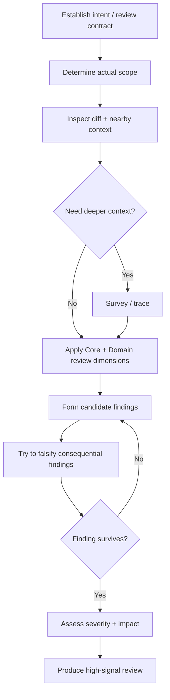

# Review Change

Review whether the change correctly implements its intent without unacceptable collateral effects. Do not optimize for number of comments.



## Workflow

### 1. Establish the review contract

Determine the intended behavior and relevant constraints from the strongest available context:

- user request;
- issue/PR description;
- accepted feature/change spec;
- tests;
- project docs/decisions;
- external contracts/standards when relevant.

If no formal spec exists, reconstruct the smallest useful review contract:

```text
Goal
Expected behavior
Constraints/contracts
Declared scope
```

If a consequential intent cannot be established, ask for that decision rather than guessing.

### 2. Determine actual scope

Inspect what changed rather than trusting the declared scope.

Consider changes to:

- files/components;
- APIs/data formats;
- state and control flow;
- lifecycle/ownership;
- persistence;
- dependencies/configuration;
- permissions/security boundaries;
- tests/verification;
- resource/timing behavior.

Compare declared versus actual scope. Unexplained expansion is a review signal.

### 3. Inspect cheaply before expanding context

Start with:

- diff/patch;
- nearby code;
- affected tests;
- relevant interfaces/contracts.

Use `survey` only when the impact area is unclear.

Use `trace` when correctness depends on a path, state transition, async boundary, data flow, or resource lifecycle.

Do not trace the entire system by default.

### 4. Apply Core review dimensions

Check the relevant subset of:

#### Intent correctness

Does the change actually solve the stated problem?

#### Contract preservation

Does it unexpectedly change API, data, error, ordering, compatibility, timing, ownership, or other externally meaningful behavior?

#### State and lifecycle

Can state become incoherent? Are creation/use/release and async lifetimes correct?

#### Failure behavior

What happens on timeout, partial failure, retry, invalid input, cancellation, or unavailable dependency?

#### Boundary conditions

Are important empty/null/min/max/overflow/first/last/repeated cases handled?

#### Side effects and scope

What changed beyond the intended behavior, and is the expansion justified?

#### Verification adequacy

Do existing/new checks actually exercise the changed behavior and its risk surface?

### 5. Apply Domain Pack review policy

If a relevant PraxFlow Domain Pack is installed, apply its review concerns.

Do not copy domain-specific checklists into Core reasoning when the domain does not apply.

### 6. Form candidate findings with evidence

A candidate finding should be able to explain:

- **what** may be wrong;
- **where/what evidence** supports the concern;
- **why** the path or state can produce the problem;
- **impact** if the concern is real.

Do not promote vague discomfort into a finding.

### 7. Try to falsify consequential findings

Before escalating an important finding, actively search for evidence that would make it false:

- upstream guards/invariants;
- type guarantees;
- alternate lifecycle ownership;
- caller preconditions;
- state conditions;
- tests covering the supposedly failing path;
- targeted runtime/build/test evidence when high-value and available.

Discard findings that do not survive the available evidence.

### 8. Assess severity without false precision

Use practical review severity:

- **Blocker** — should not merge/ship as-is.
- **Major** — substantive correctness/risk issue that should be fixed.
- **Minor** — real but limited issue; may not block.
- **Suggestion** — optional improvement, clearly separated from correctness findings.

Do not inflate personal style preference into a correctness issue.

### 9. Produce a high-signal review

Order findings by severity and decision value.

For each substantive finding, include concise evidence and impact. Provide a suggested direction when it helps, but do not redesign the entire system unless necessary to explain the issue.

It is valid to return zero findings.

If relevant, separately identify verification gaps without pretending they are confirmed bugs.

## Noise guardrails

Do not report by default:

- pure personal preference;
- unrelated pre-existing issues;
- speculative risks with no plausible path;
- formatting/lint issues already handled by tooling;
- hypothetical future architecture concerns unrelated to the change;
- a long list of generic best practices with no evidence in the diff.

## Completion criteria

A review is complete when:

- intent and actual scope are understood well enough for judgment;
- relevant Core and Domain concerns have been checked;
- important candidate findings have been challenged against contrary evidence;
- reported findings are actionable and evidence-backed at the stated level of certainty;
- noise is omitted;
- verification gaps are explicit when they materially limit confidence.
