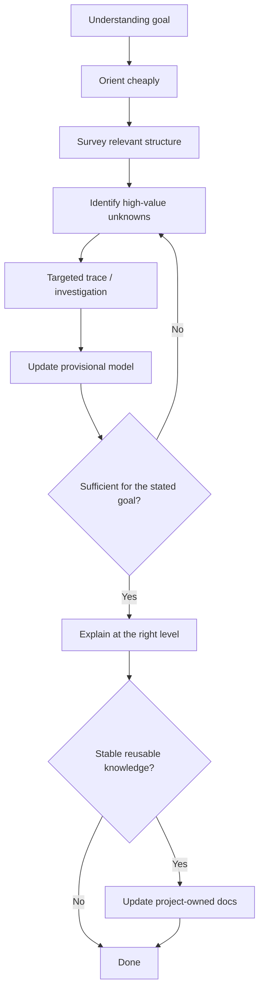

# Understand Project

Build enough trustworthy understanding to answer the user's stated question. Do not treat full-repository reading or automatic architecture documentation as the default.



## Workflow

### 1. Establish the understanding goal

Clarify what the user actually needs to know:

- overall orientation;
- one subsystem;
- startup/shutdown;
- request/data flow;
- ownership/lifecycle;
- module/process/thread boundaries;
- a legacy area they need to modify later.

If the goal is only to complete another task, use the relevant Workflow and its targeted understanding phases instead of running this full Workflow.

### 2. Orient cheaply

Start with low-cost structural evidence:

- README and existing docs;
- top-level repository structure;
- manifests/build files;
- obvious application/service entry points;
- tests;
- configuration;
- important generated/source boundaries.

Do not produce a directory-by-directory summary.

### 3. Survey the relevant project structure

Use `survey` when available.

Build a provisional map of:

- major relevant components;
- entry points;
- dependencies and boundaries;
- state/persistence;
- important interfaces;
- project capabilities relevant to understanding behavior;
- high-value unknowns.

Keep observed facts separate from inferences.

### 4. Identify architectural questions with high information value

Examples:

- who owns this component's lifecycle?
- where does state live?
- which process/thread executes this path?
- where does external input enter?
- where are async boundaries?
- how are errors propagated?
- which component is authoritative for this data?

Do not continue reading merely because unread code remains.

### 5. Trace selected paths

Use `trace` for behaviors whose exact flow materially affects the user's understanding goal.

Possible targeted traces:

- startup;
- one representative request;
- data ingestion;
- state mutation;
- shutdown;
- failure path.

Choose traces for information value, not completeness.

### 6. Update the provisional model

After each investigation:

- add supported facts;
- revise contradicted inferences;
- mark important unknowns;
- remove detail that does not affect the model.

Treat documentation and naming as evidence, not automatic truth. Reconcile discrepancies with observed code/runtime behavior where necessary.

### 7. Test sufficiency

Ask whether the current model is sufficient to answer the stated understanding goal reliably.

If not, select the next highest-value unknown and investigate it.

If yes, stop. There is no requirement to “finish reading the project.”

### 8. Explain at the right level

Prefer a coherent model over exhaustive notes.

A useful explanation may include:

```markdown
## System / subsystem model
...

## Key flow(s)
...

## Ownership / state
...

## Important constraints
...

## Unresolved but relevant unknowns
...
```

Use diagrams/text paths when they make relationships clearer.

### 9. Persist only stable reusable knowledge

Do not automatically generate `architecture.md`.

Persist project documentation only when:

- the user explicitly requests it;
- stable architecture knowledge is missing and likely to be reused;
- the investigation established a consequential durable constraint/decision;
- an existing canonical doc must be corrected after intended behavior is established.

Temporary working maps remain ephemeral by default.

## Completion criteria

The Workflow is complete when:

- the user's stated understanding goal can be answered coherently;
- important claims are evidence-backed or labeled as inference/unknown;
- no unresolved unknown is likely to reverse the central explanation;
- unnecessary repository-wide exploration has stopped;
- durable docs are updated only when justified.
